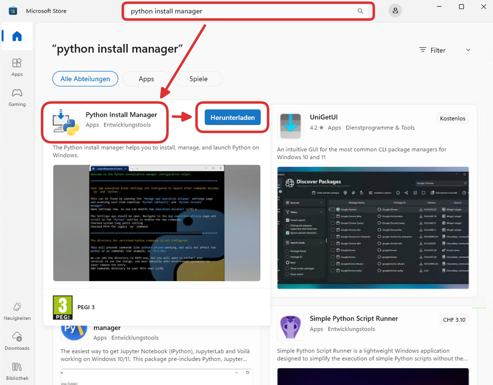
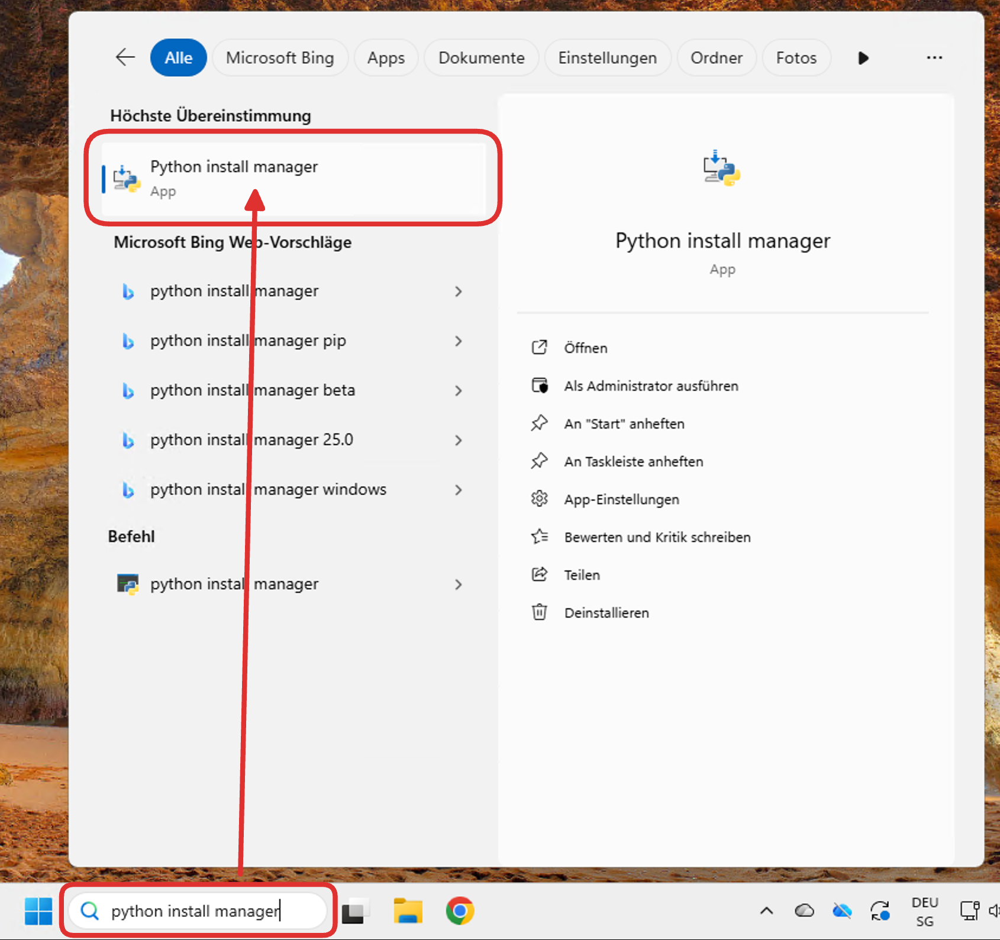
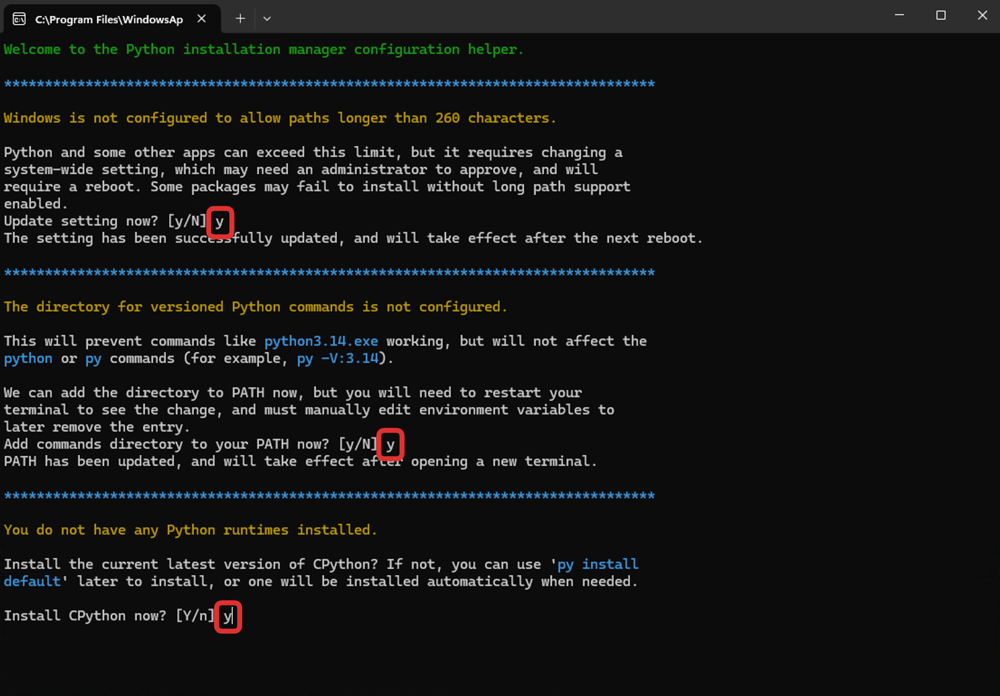
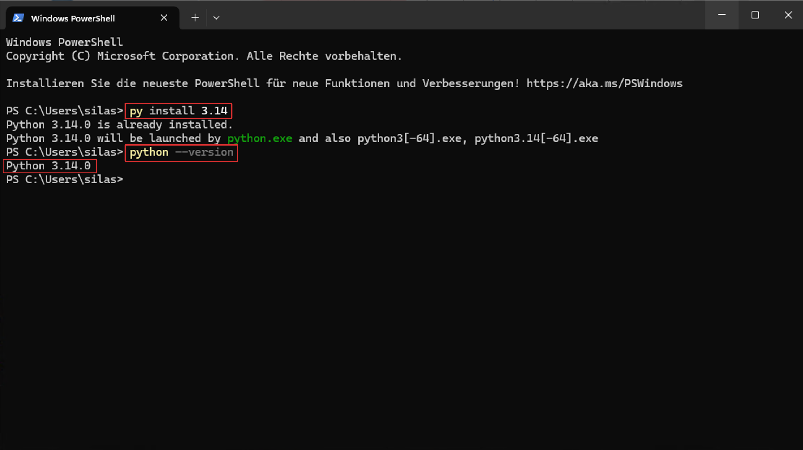

import OsTabs from '@tdev-components/OsTabs'
import TabItem from "@theme/TabItem";
import Steps from '@tdev-components/Steps'

# Python installieren
Um ein Python-Programm ausführen zu können, müssen wir auf unserem Computer die Python-Umgebung installiert haben.

:::info[Separate Installation]
Falls Sie bereits mit Programmen wie _Thonny_ gearbeitet haben, konnten Sie Python-Programme ausführen, ohne dass Sie Python explizit installieren mussten. Solche Programmierumgebungen sind auf den Anfänger:innen-Unterricht ausgerichtet und bringen deshalb ihre eigene Python-Umgebung mit. Wenn wir aber mit professionellen Werkzeugen wie _VSCode_ arbeiten, müssen wir Python separat installieren.
:::

<OsTabs>
  <TabItem value="win">
  <Steps>
  1. Öffnen Sie den _Microsoft Store_, suchen Sie nach `python install manager` und laden Sie die entsprechende App herunter:

     

     Danach können Sie den _Microsoft Store_ wieder schliessen.
  2. Öffnen Sie den _Python install manager_ über die globale Suche:

     
  3. Es öffnet sich anschliessend ein _Terminal_. Darin werden Ihnen Schritt für Schritt einige Fragen gestellt. Beantworten Sie die **ersten drei Fragen** jeweils mit «ja», indem Sie `y` (für _yes_) eingeben und mit [[Enter]] bestätigen. Die vierte Frage (`View online help?`) können Sie mit «nein» beantworten: [[n]] → [[Enter]].
     
  4. Sobald das _Terminal_ sich geschlossen hat, **starten Sie Ihren Computer neu**, damit die Änderungen übernommen werden.
  5. Nach dem Neustart, öffnen Sie über die globale Suche das Programm `Terminal`. Dort geben Sie zuerst den folgenden Befehl ein und bestätigen ihn mit [[Enter]]:
     ```bash
     py install 3.14
     ```
     Prüfen Sie, ob keine Fehlermeldung erscheint.
  6. Dann geben Sie folgenden Befehl ein und bestätigen ihn wieder mit [[Enter]]:
     ```bash
     python --version
     ```
     Kontrollieren Sie dann noch, dass in der «Antwort» (also in der _Ausgabe_ des Befehls) die Version `3.14.x` angegeben wird (die letzte Zahl kann variieren). Am Schluss sollte Ihr _Terminal_ in etwa so aussehen:
     
  7. Schliessen Sie das Terminal-Fenster. Die Einrichtung von Python ist abgeschlossen.
  </Steps>
  </TabItem>

  <TabItem value="mac">
  <Steps>
    1. Laden Sie die [Installationsdatei für die Python-Version 3.14.6](https://www.python.org/ftp/python/3.14.6/python-3.14.6-macos11.pkg) herunter.
    2. Gehen Sie in Ihren __Downloads__-Ordner, öffnen Sie die Datei `python-3.14.6-macos11.pkg` und folgen Sie den Anweisungen des Installationsprogramms, um Python zu installieren. Sie müssen dabei **keine Einstellungen anpassen**. Am Schluss können Sie die Installationsdatei in den Papierkorb verschieben lassen, wenn Sie danach gefragt werden.
    3. Öffnen Sie das Programm `Terminal.app` (z.B. über die Spotlight-Suche). Dort geben Sie den folgenden Befehl ein und bestätigen ihn mit [[Enter]]:
        ```bash
        sudo ln -s /usr/local/bin/python3 /usr/local/bin/python
        ```
        Sobald Sie danach gefragt werden, geben Sie Ihr **Mac-Passwort** (mit dem Sie sich auch in den Laptop einloggen) ein (beim Tippen werden keine Zeichen angezeigt) und bestätigen mit [[Enter]].
    4. Führen Sie zur Kontrolle noch folgenden Befehl aus und bestätigen ihn wieder mit [[Enter]]:
        ```bash
        python --version
        ```
        In der Ausgabe sollte nun etwas von `3.14.6` stehen. Wenn das der Fall ist, dann ist die Einrichtung abgeschlossen.
  </Steps>
  </TabItem>
</OsTabs>

:::aufgabe[Python installiert]
<TaskState id="42f69f7f-d058-4a30-abb7-b98ee9fdab70" />
Markieren Sie diese Aufgabe als erledigt, sobald Sie Python auf Ihrem Computer installiert und auf die korrekte Version (`3.14.x`, die letzte Zahl kann variieren) geprüft haben.
:::