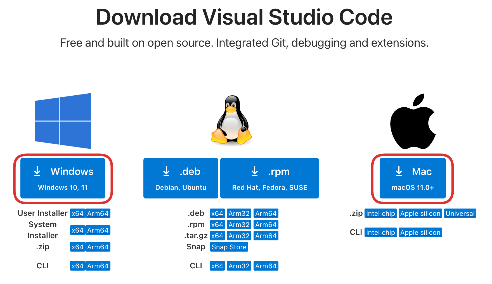

import OsTabs from '@tdev-components/OsTabs'
import TabItem from "@theme/TabItem";
import Steps from '@tdev-components/Steps'

# VSCode einrichten
_Visual Studio Code_ (kurz: _VSCode_) ist eine professionelle Programmierumgebung, die man sowohl für Python, als auch für praktisch jede andere Programmiersprache verwenden kann.

<Steps>
1. Laden Sie sich auf der [offiziellen Webseite](https://code.visualstudio.com/download) die korrekte Version der VSCode-Installationsdatei herunter:

   

2. Identifizieren Sie die heruntergeladene Installationsdatei im `Downloads`-Ordner. Führen Sie die sie aus, indem Sie sie doppelklicken. Sie können bei allen Installationsschritten die Standardeinstellungen akzeptieren (ändern Sie insbesondere **nicht** den Installationspfad).
3. Falls sich VSCode während der Installation automatisch öffnet, können Sie es wieder schliessen. Die Installation ist abgeschlossen.
4. Löschen Sie die Installationsdatei aus dem `Downloads`-Ordner, sobald die Installation abgeschlossen ist.
</Steps>

:::aufgabe[VSCode installiert]
<TaskState id="15d5cae4-1db6-4243-af03-384df6502f5a" />
Markieren Sie diese Aufgabe als erledigt, sobald Sie VSCode auf Ihrem Computer installiert haben.
:::

---