import Steps from '@tdev-components/Steps'
import ProgressState from '@tdev-components/documents/ProgressState';

# WSL

WSL2
: Windows Subsystem for Linux ermöglicht es, Linux-Tools und -Anwendungen direkt auf dem Windows-System auszuführen, ohne eine separate virtuelle Maschine oder Dual-Boot-Konfiguration einrichten zu müssen.

## Installation

<Steps>
1. Öffnen Sie PowerShell als Administrator:in
    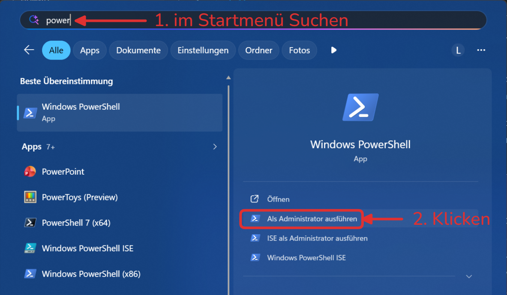
2. Geben Sie den folgenden Befehl ein und drücken Sie Enter, um WSL zu installieren:

   ```powershell
   wsl --install
   ```

   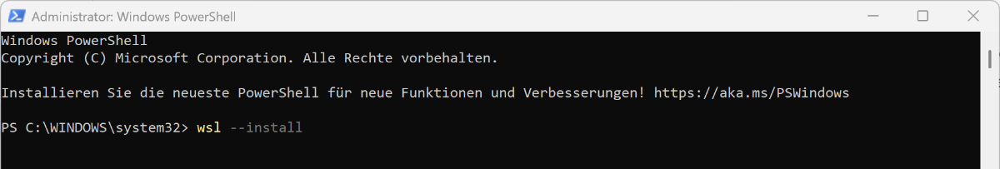

   :::details[Troubleshooting]
   [Bei Problemen kann diese Seite helfen](https://learn.microsoft.com/en-us/windows/wsl/troubleshooting#installation-issues)
   :::

3. Starten Sie Ihren Computer neu, wenn Sie dazu aufgefordert werden.
   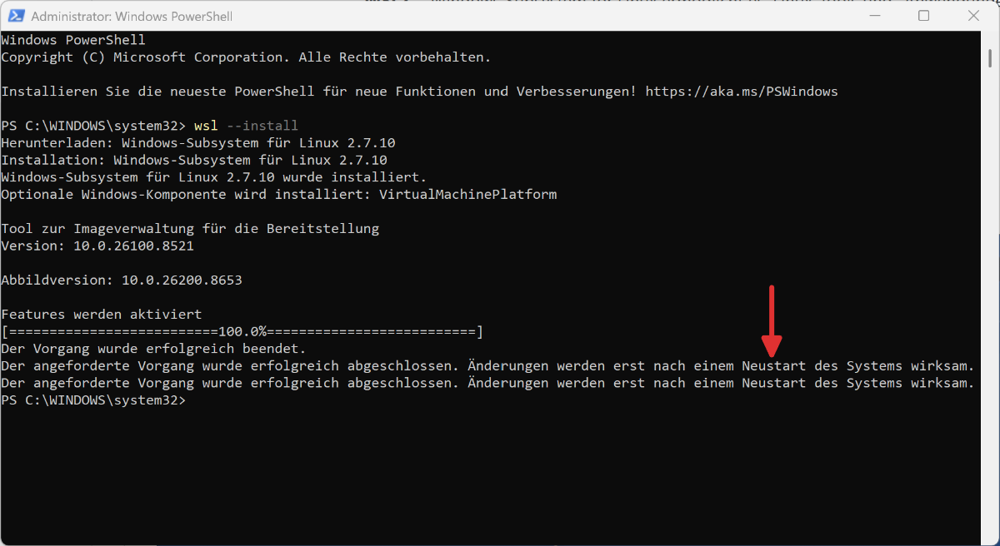
4. Ubuntu installieren: Öffnen Sie PowerShell erneut als __Administrator:in__ und geben Sie den folgenden Befehl ein:

   ```powershell
   wsl --install ubuntu
   ```

   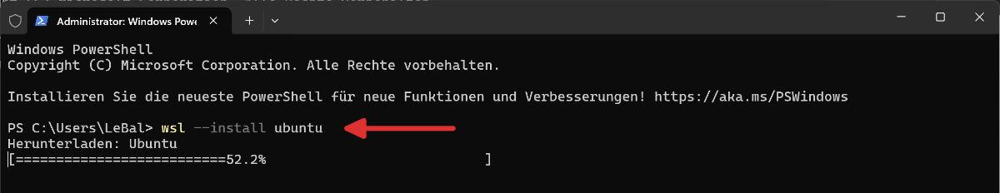

5. Ubuntu __erstmalig__ starten: Benutzer:in und Passwort festlegen:
   - **Benutzername**: z.B. Ihr Vorname - ohne Sonderzeichen oder Umlaute
   - **Passwort**: darf etwas einfaches sein (`1234` oder `asdf`), da für den Zugriff auf WSL zuerst das Windows-Passwort verwendet wird.

    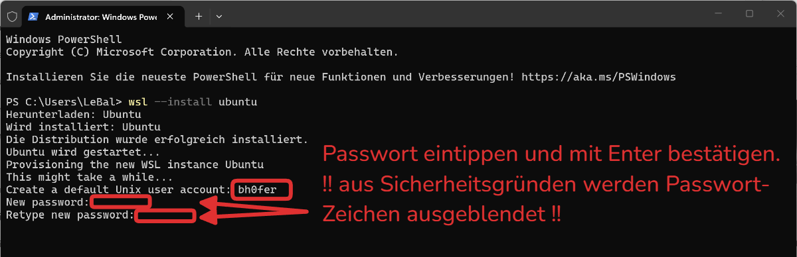

   Falls Sie gefragt werden, ob Sie Nutzungsdaten an Ubuntu senden möchtem, können Sie dies mit `y` annehmen, oder mit `n` ablehnen.
    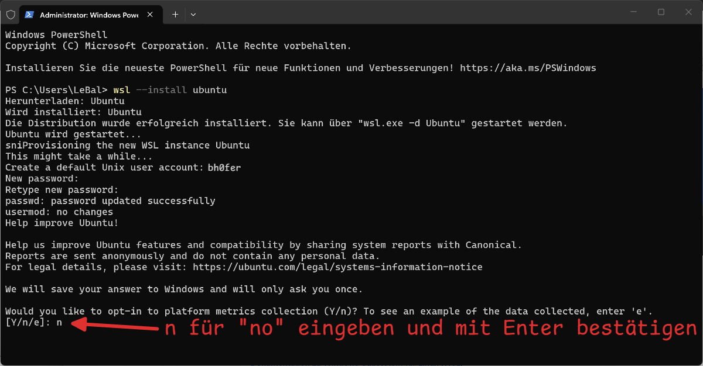


6. Aktuelle Ubuntu-Version prüfen:

   Öffnen Sie das __Terminal__ und öffnen Sie darin das Ubuntu-Terminal:

   (Bei älteren Windows-Versionen kann es sein, dass das Terminal nicht installiert ist. Installieren Sie es von [hier](https://apps.microsoft.com/detail/9n0dx20hk701?hl=de-DE&gl=DE))

   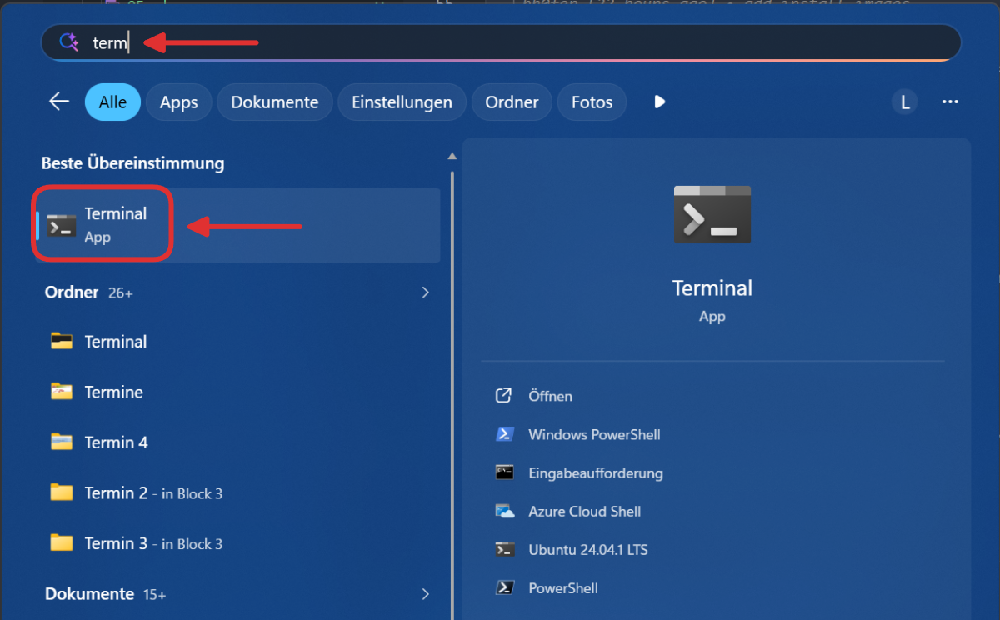

    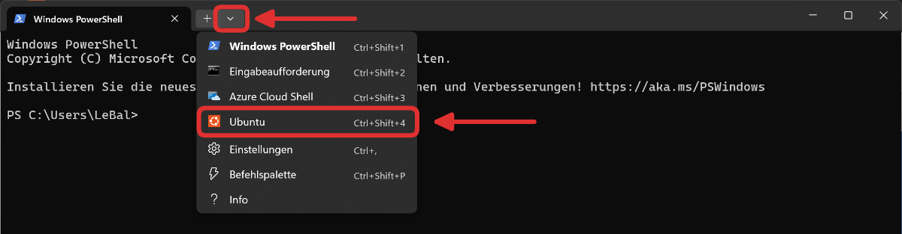

    und überprüfen Sie die aktuelle Ubuntu-Version mit folgendem Befehl:

    ```bash
    lsb_release -a
    ```
    
    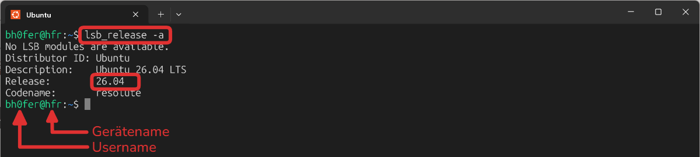

    ::::tip[Farbschema anpassen]
    Standardmässig verwendet Ubuntu ein violettes Terminal. Damit das Terminal genau gleich aussieht wie oben im Screenshot, kann das **Farbschema** angepasst werden.
    :::details[Anleitung]
    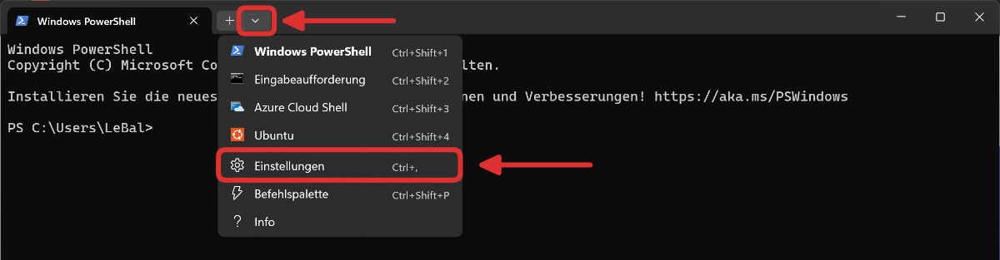
    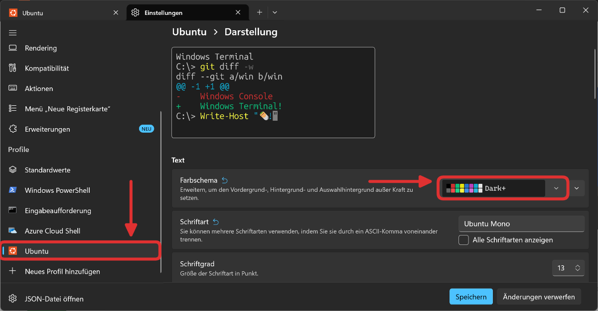
    :::
    ::::

   :::details[Optional: Ubuntu-Terminal als Standard-Terminal festlegen]
    

    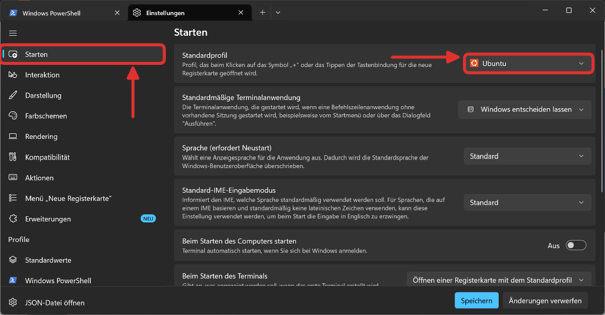
   :::


7. Ubuntu aktualisieren:

   ```bash
   sudo apt update
   sudo apt upgrade
   ```

   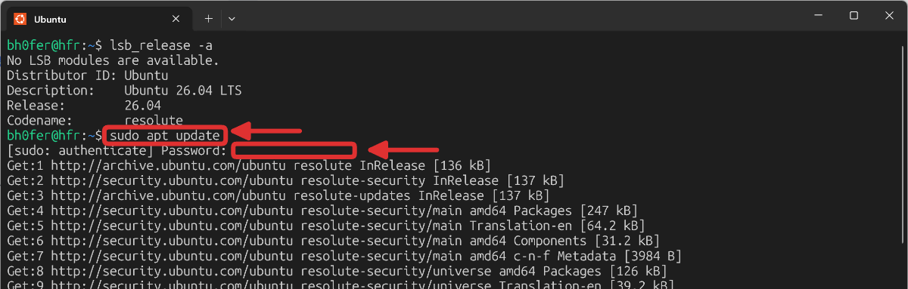

   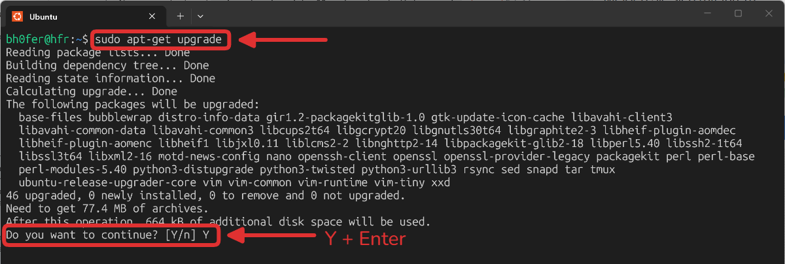
</Steps>


:::aufgabe[Quickstart: Linux]
<Answer type="state" id="d7c08e31-ba27-4ce3-a710-3e009734558f" />

Die Linux-Kommandozeile wird nur mit Befehlen bedient. Diese hören sich zunächst kompliziert und unverständlich an, weil sie stark abgekürzt wurden, um den Tippaufwand zu reduizieren. Grundsätzlich sind sie aber logisch aufgebaut.

Probieren Sie die folgenden Befehle aus, um sich einen ersten Eindruck zu verschaffen.

<Steps>
1. `ls` für _list_ - listet alle Dateien und Ordner im aktuellen Verzeichnis auf
   Zeige alle Dateien und Ordner im aktuellen Verzeichnis an. Aktuell ist das Home-Verzeichnis noch leer, daher wird nichts angezeigt:

   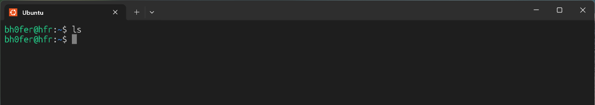

2. mit `touch <Dateiname>` kann eine neue Datei erstellt werden. Beispiel: `touch hello.txt` erstellt eine neue Datei mit dem Namen `hello.txt`. Mit `ls` kann überprüft werden, ob die Datei erstellt wurde:

   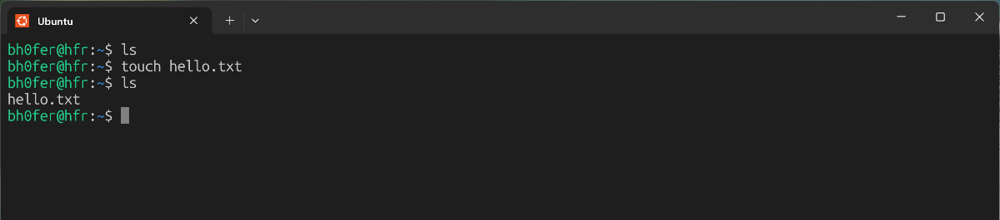

3. mit `nano <Dateiname>` kann eine Datei bearbeitet werden. Beispiel: `nano hello.txt` öffnet die Datei `hello.txt` im Editor `nano`. Mit der Tastenkombination [[ctrl]]+[[x]] wird der Editor wieder geschlossen.

   ::video[./images/Terminal/nano.mp4]

4. `cat` für _concatenate_ - mit `cat <Dateiname>` kann der Inhalt einer Datei angezeigt werden. Beispiel: `cat hello.txt` zeigt den Inhalt der Datei `hello.txt` an.

   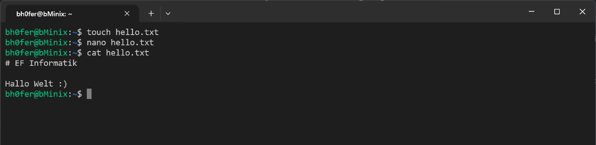

5. `mkdir` für _make directory_ - `mkdir <Ordnername>` - erstellt einen neuen Ordner mit dem angegebenen Namen. Beispiel: `mkdir ef` erstellt einen neuen Ordner mit dem Namen `ef`.

   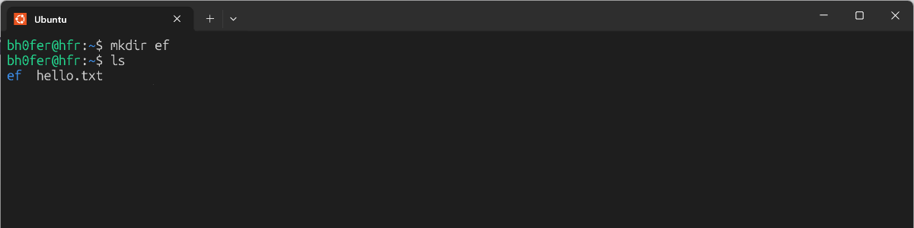

6. `cd` für _change directory_ - `cd <Ordnername>` wechselt in ein anderes Verzeichnis. Beispiel: `cd ef` wechselt in den Ordner `ef`.

   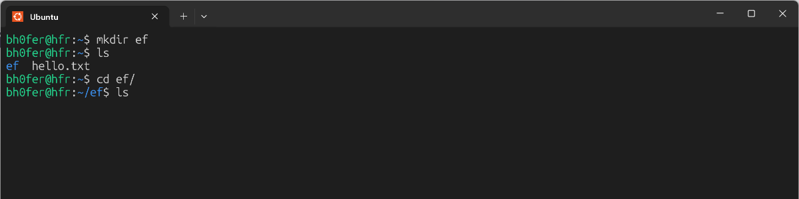
   
7. `pwd` für _print working directory_ - `pwd` zeigt den aktuellen Pfad an. Beispiel: `pwd` zeigt den aktuellen Pfad an.

   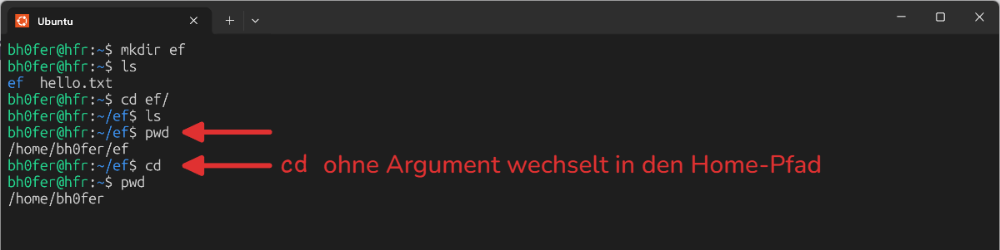

8. `sudo apt install <Paketname>` - installiert ein Paket. Beispiel: `sudo apt install sl` installiert das Paket `sl`. Mit `sl` werden Vertipper beim Eingeben von `ls` durch eine animierte "bestraft" :).

   ```bash
   sudo apt install sl
   sl
   ```

   ::video[./images/Terminal/sl.mp4]{autoplay=1}
9. Markieren Sie die Aufgabe als erledigt, wenn Sie alle bisherigen Befehle ausprobiert haben.
</Steps>

Weitere Befehle

`rm <Dateiname>`
: `remove` löscht eine Datei.
: Beispiel: `rm hello.txt` löscht die Datei `hello.txt`.
`rm -r <Ordnername>`
: `remove` löscht einen Ordner und dessen Inhalt.
: Beispiel: `rm -r ef` löscht den Ordner `ef` und dessen Inhalt.
`mv <Dateiname> <NeuerDateiname>`
: `move` verschiebt eine Datei oder benennt sie um.
: Beispiel: `mv hello.txt hallo.txt` benennt die Datei `hello.txt` in `hallo.txt` um.
`cp <Dateiname> <NeuerDateiname>`
: `copy` kopiert eine Datei.
: Beispiel: `cp hallo.txt hallo2.txt` kopiert die Datei `hallo.txt` in `hallo2.txt`.

:::