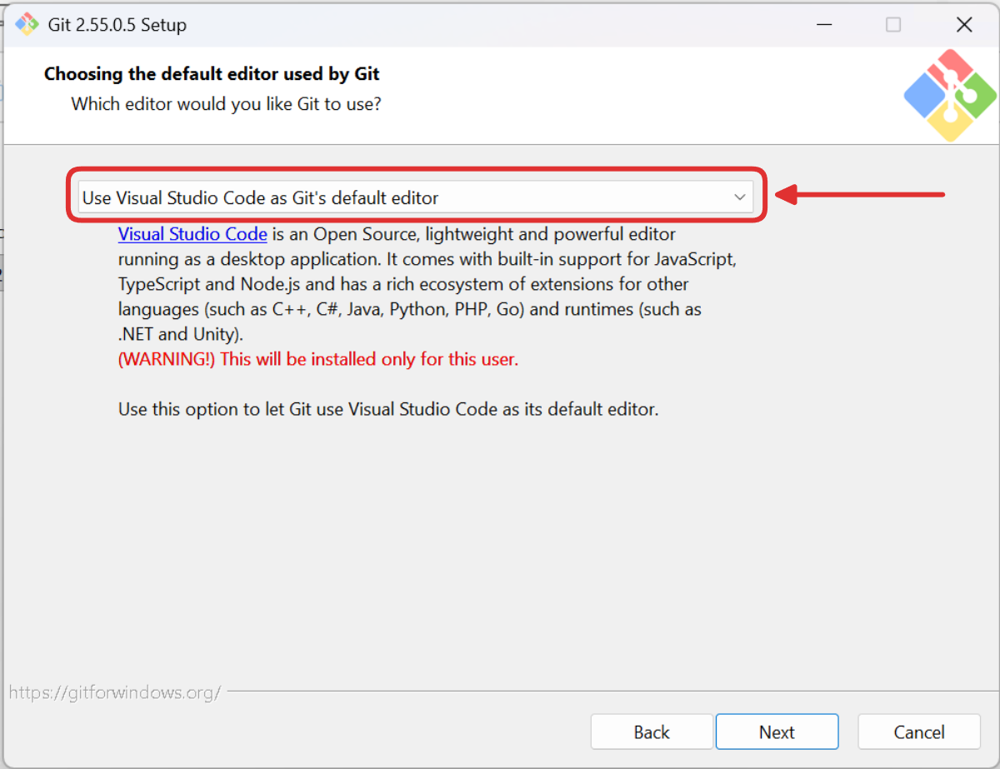
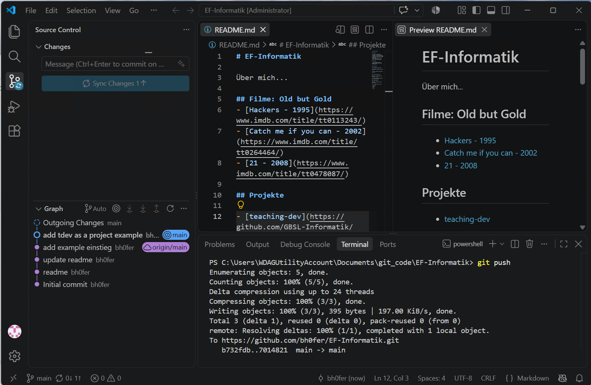
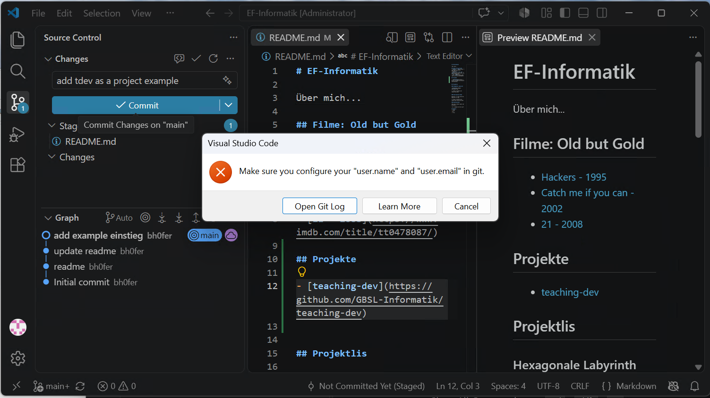
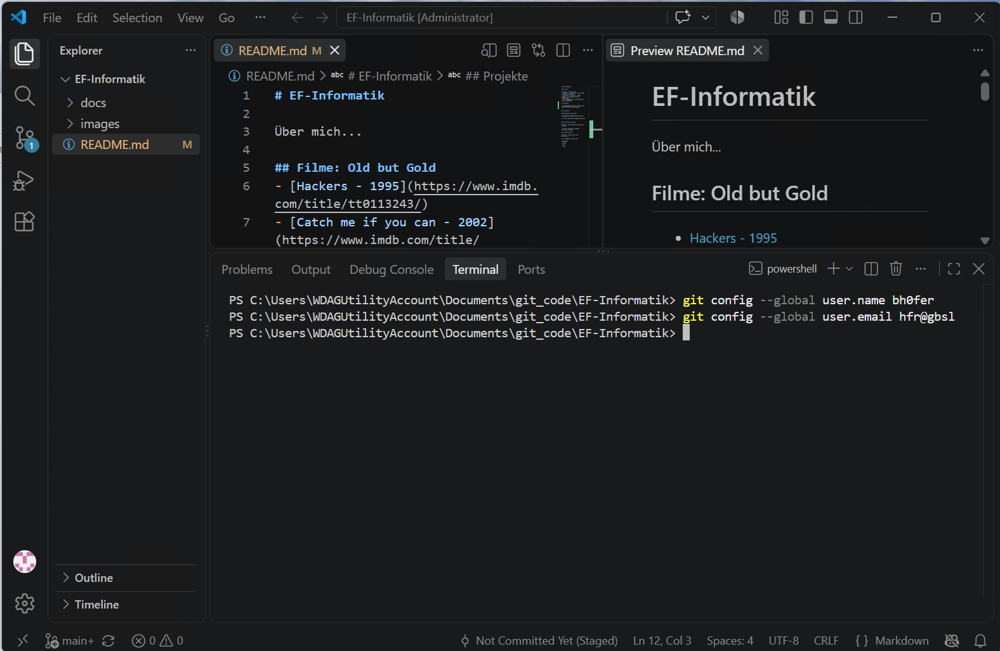
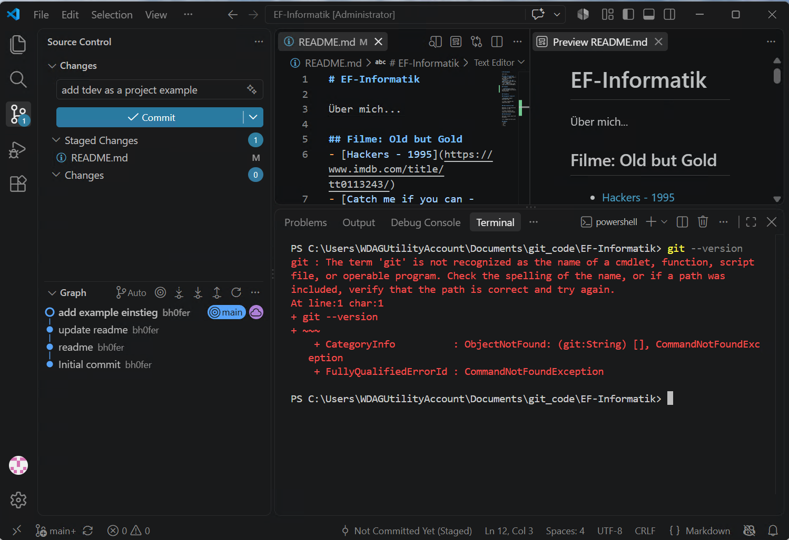
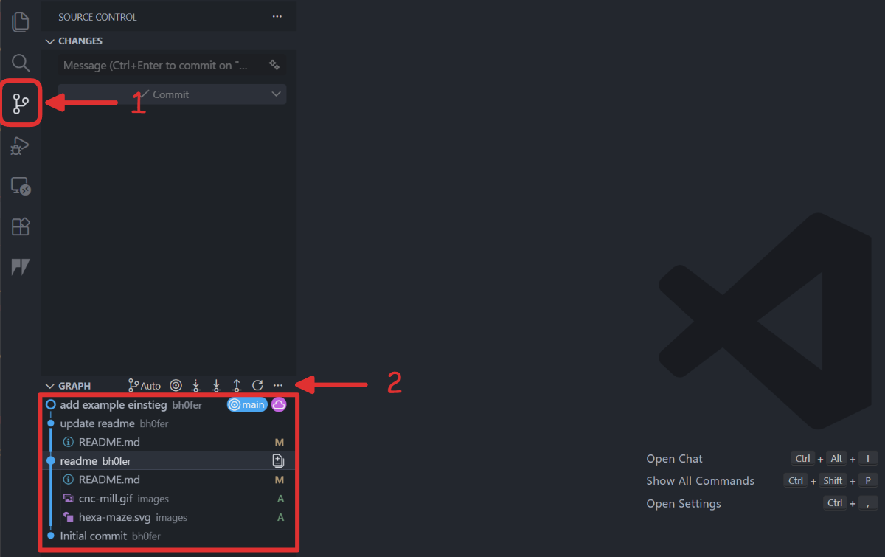

import Steps from '@tdev-components/Steps';
import OsTabs from '@tdev-components/OsTabs'
import TabItem from "@theme/TabItem";

# Git Repository klonen

::::aufgabe[Git installieren]
<Answer type="state" id="1d0750c8-491f-4fad-ad35-af1f79a2d8a6" />

<Steps>
1. In einem ersten Schritt muss Git installiert und konfiguriert werden.
   Git herunterladen
   : https://git-scm.com/install/
   Zu Beachten
   :::dd
   <OsTabs>
         <TabItem value="win">
            Unter **Windows** sollten Sie bei folgendem Installationsschritt die Option **VS Code** als Standard-Editor auswählen - alle anderen Optionen sind standardmässig vernünftig gewählt.
            
            
         </TabItem>
         <TabItem value="mac">
            Unter **Mac** müssen Sie ggf. `brew` installieren - ein Paketmanager für MacOS. Folgen Sie dazu den Anweisungen auf der Webseite: https://brew.sh/
         </TabItem>
   </OsTabs>
   :::
2. Git konfigurieren
   Nach der Installation müssen Sie die Git-Konfiguration durchführen, um sich als Autor:in zu identifizieren. Dabei wird der Name und die Email-Adresse, welche für die Kennzeichnung von Commits verwendet wird, festgelegt.
   Dies kann in einer Git-Shell konfiguriert werden (auf Mac: im `Terminal`, auf Windows: im `Terminal` oder in `Git Bash`).
   Dort müssen folgende Kommandos eingegeben werden (wobei Sie natürlich Ihren Namen (oder Github-Nickname) anstatt FooBar verwenden, ebenso bei der Mail...)

   ```bash
   git config --global user.name FooBar
   git config --global user.email foo@bar.ch
   ```
   
   Überprüfen obs geklappt hat:
   ```bash
   git config --global user.name
   git config --global user.email
   ```
3. Aufgabe als erledigt markieren 🥳.
</Steps>
::::

:::::aufgabe[Github Repository klonen]
<Answer type="state" id="249021f4-5bee-4b50-acb7-70e156701c50"/>

Klonen Sie das Repository auf Ihren Laptop.

<Steps>
1. Erstellen Sie auf Ihrem Laptop zuerst einen neuen Ordner (bspw. unter `Dokumente/git_code`), in welchem Sie künftig alle git Repositories abspeichern.
   :::danger[git repositories nicht auf OneDrive/Dropbox]
   Git-Repositories haben ein grundlegend anderen Ansatz zur Synchronisierung von Daten. Wird ein git-Repo über bspw. Dropbox synchronisiert, werden laufend die Änderungen (von einem anderen Computer) synchronisiert, auch wenn die Änderungen per Git noch gar nicht veröffentlicht wurden. Die Folge sind viele Änderungen (und Probleme)...
   :::
2. Klonen Sie das Repository (wie im (stummen) Video gezeigt):
   ::video[./images/gh-clone-hd.mp4]{muted=true}
3. README.md bearbeiten: Fügen Sie einen Code-Block hinzu, `stagen` Sie die Änderungen, schreiben Sie eine Änderungs-Nachricht, `commiten` Sie die Änderungen, und `pushen` Sie diese.
   ````md
   ```py
   print('Hello World')
   ```
   ````
   :::details[Alles übers Terminal]
   ```bash
   git add .
   git commit -m "Füge Hello World Codeblock hinzu"
   git status
   git push
   ```
   
   :::
4. Kontrollieren Sie, ob die Änderungen online auf Github sichtbar sind.
5. Markieren Sie die Aufgabe als erledigt.
</Steps>


::::details[Troubleshooting]

#### Fehlermeldung: Commiten funktioniert nicht

:::success[Lösung]

:::

#### Fehlermeldung: `term 'git' not found`

:::success[Lösung]
VS Code schliessen und nochmals öffnen - klappt es immer noch nicht: Git wie oben beschrieben erneut installieren (oder den Laptop neu starten).
:::

::::
:::::

:::aufgabe[Git History untersuchen]
<Answer type="state" id="650341aa-80fd-4ca2-9d51-b27ae1ad2cc0" />

Unetrsuchen Sie in VS-Code die Git History ihres Repositories:



1. Was ist die Bedeutung der Buchstaben __A__ und __M__ in der Git History?
2. Untersuchen Sie die einzelnen Commits, indem Sie auf die Commit-Nachricht klicken. Welche Änderungen wurden in den einzelnen Commits gemacht?
3. Markieren Sie die Aufgabe als erledigt.
:::
