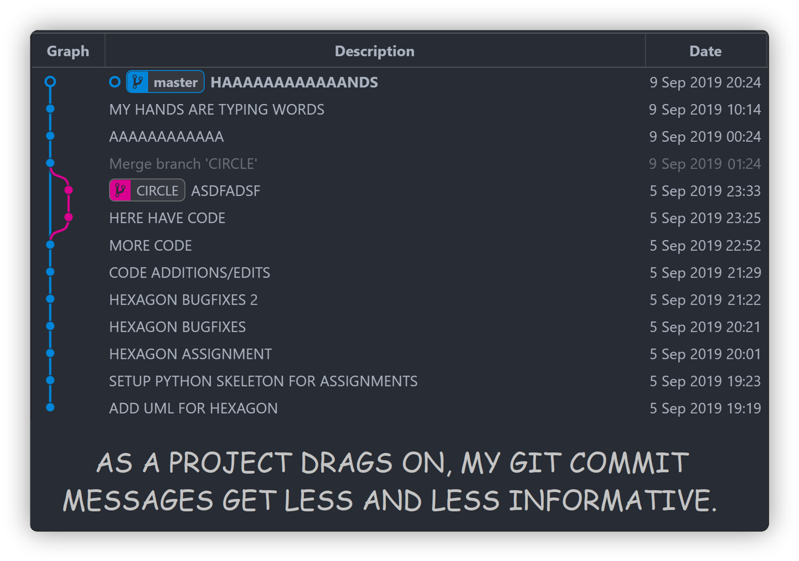
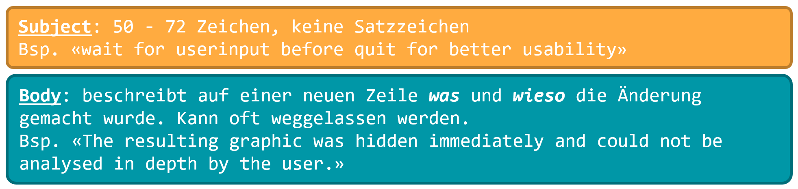

import PageReadCheck from '@tdev/page-read-check/PageReadCheck';

# Git Commit Nachrichten

 

Wie verfasst man gute Commit-Nachrichten? Das ist gar nicht so einfach. Schaut man sich auf Github um, so sind die meisten strukturiert verfassten Commit-Nachrichten nach dem "Imperative Mood" [^1] aufgebaut. Über alls Commit-Nachrichten gesehen, sind es doch immerhin fast 50% der Nachrichten, die danach verfasst sind [^2].

## Imperative Mood

Eine Commit-Nachricht ist in zwei Teile gegliedert:

Hilfestellung für die Titelzeile:
- *If applied, this commit will*... **«update getting started documentation»**
- Imperativ verwenden (ohne abschliessende Satzzeichen):
  - «Putz dein Zimmer»
  - «Schliess die Türe»
  - `Entferne überflüssige Funktion 'run'`
  - `Überarbeite code und füge Kommentare hinzu`
  - `Fix typo in the function name 'play'`

Commit-Nachrichten sollen entweder auf **Englisch** oder **Deutsch**, aber immer gleich für ein Repository. 

<PageReadCheck id="759dd0f7-7732-403b-bbef-cfb6be8bb880" minReadTime={60} />

[^1]: Quelle: https://www.theserverside.com/video/Follow-these-git-commit-message-guidelines
[^2]: Quelle: https://initialcommit.com/blog/Git-Commit-Message-Imperative-Mood