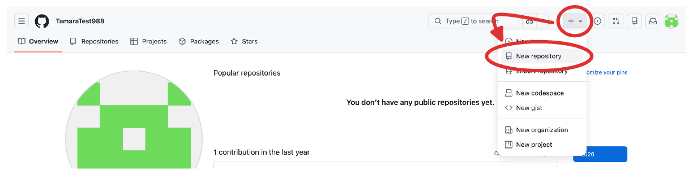
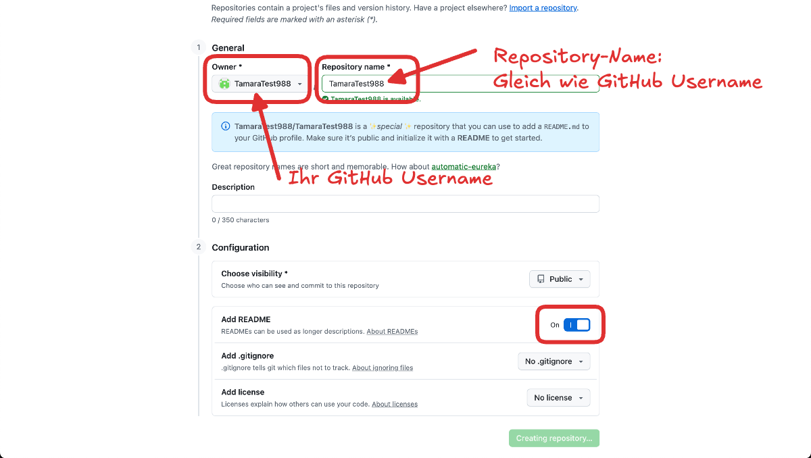
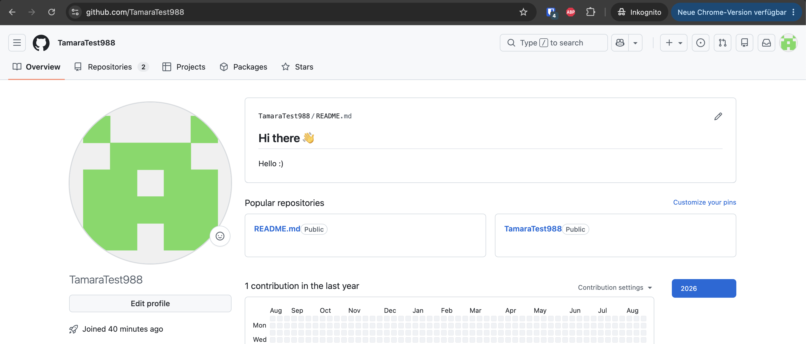
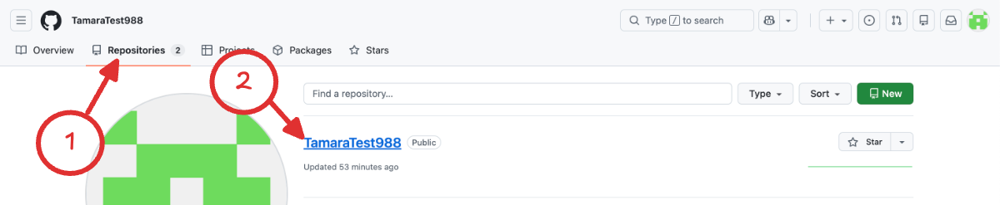

import ProgressState from '@tdev-components/documents/ProgressState';

# Markdown
Die Dokumentation verfassen wir im Markdown-Format - eine Markup Langauge, welche weniger explizite Steuerzeichen als etwa HTML braucht.

::::aufgabe[Tutorial]
<Answer type="state" id="c80c4159-2341-48bf-8851-f047c58b9057" />

Bearbeiten Sie das Tutrial inkl. der Übungen zu Markdown auf der Seite

https://commonmark.org/

und markieren Sie die Aufgabe anschliessend als erledigt.

:::danger[Achtung]
Im Tutorial wird eine Möglichkeit gezeigt, wie man neue Zeilen macht. Verwenden Sie die Option mit zwei Leerschlägen am Ende der Zeile, so dass Ihre Markdowns die grösstmögliche Kompatibilität aufweisen - ein `\` wird nicht immer unterstüzt.
:::
::::

## GitHub: Sneak Peak
Um unseren Code zu versionieren und synchronisieren, verwenden wir GitHub. Github ist aktuell der Quasi-Standard für Open Source Software und bietet Entwicklern kostenlos die Möglichkeit, sogenannte **Repositories** zu erstellen. Zu diesem Begriff später mehr.

Im Kickoff-Meeting vor den Sommerferien haben Sie bereits ein GitHub-Konto erstellt.

::::aufgabe[Steckbrief]
In dieser Aufgabe fügen Sie Ihrem GitHub-Profil einen kleinen Steckbrief hinzu.

<ProgressState id="cde2294d-ebe8-45ad-8a8a-bdf16278546d">
  1. Loggen Sie sich auf https://github.com/ mit Ihrem vor den Ferien erstellten GitHub-Konto ein.
  2. Erstellen Sie ein neues Repository:
     
  3. Der Name des Repositorys soll genau Ihrem GitHub-Namen entsprechen (weil es sich hier um ein besonderes Repository handelt). Zudem soll die Option __Add README__ aktiviert sein.
     
  4. Nun ist Ihr "Profi-Repository" (gleicher Name wie Ihr GitHub-Username) erstellt und es wurde bereits eine Datei namens `README.md` hinzugefügt. Alles, was Sie in diese Datei reinschreiben (inkl. Bilder) erscheint in Ihrem öffentlichen Profil. 
     Klicken Sie auf das Bleistift-Icon, um die `README.md`-Datei zu bearbeiten.
     
  5. In diesem Editor können Sie nun mit **Markdown**-Syntax einen Steckbrief (mit Hobbies, Lieblings-Games, Lieblingsfilmen, Lieblingsessen, etc.) erstellen. **Achtung:** Alle Angaben sind in Ihrem öffentlichen Profil sichtbar. 
     Sobald Sie mit Ihrem Steckbrief zufrieden sind, können Sie Ihre Änderung mit dem Button __Commit changes…__ speichern.
     
     Lassen Sie alle Einstellungen unverändert und klicken Sie erneut auf __Commit changes…__.
     
  6. Sehen Sie sich Ihr Profil an, indem Sie oben rechts auf Ihr Profilbild und dann auf __Profile__ klicken.
     
     Ihr Steckbrief sollte jetzt hier ersichtlich sein.
     
     Ihr öffentliches Profil ist auch über die URL https://github.com/Ihr_GitHub_Username (also z.B. https://github.com/TamaraTest988) aufrufbar.
  7. Wenn Sie an Ihren Steckbrief noch etwas anpassen wollen, können Sie direkt in Ihrem Profil beim Steckbrief (`README.md`) auf das Bleistift-Icon klicken. Alternativ können Sie auch jederzeit über die Repositories-Übersicht zu Ihren Profil-Repository zurückkehren und dort dann die Datei `README.md` anklicken, um sie zu bearbeiten.
     
</ProgressState>
::::
