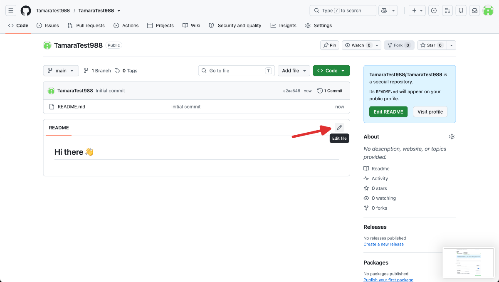
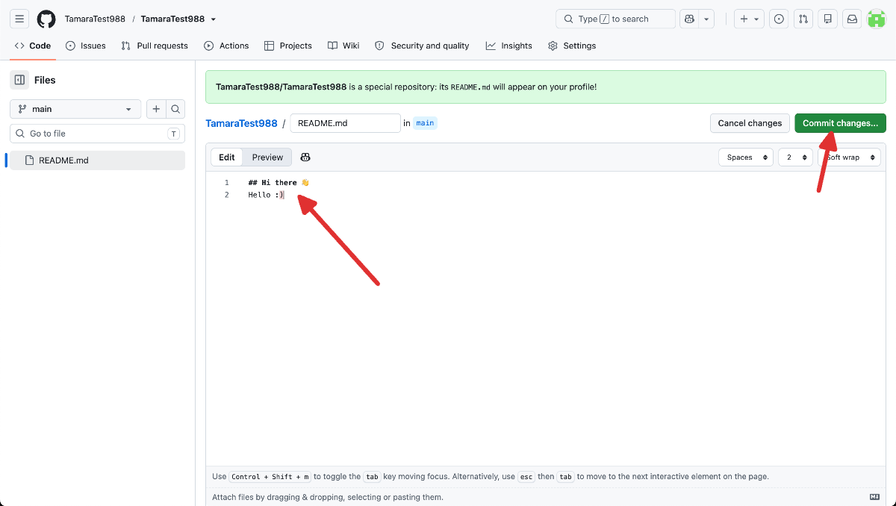
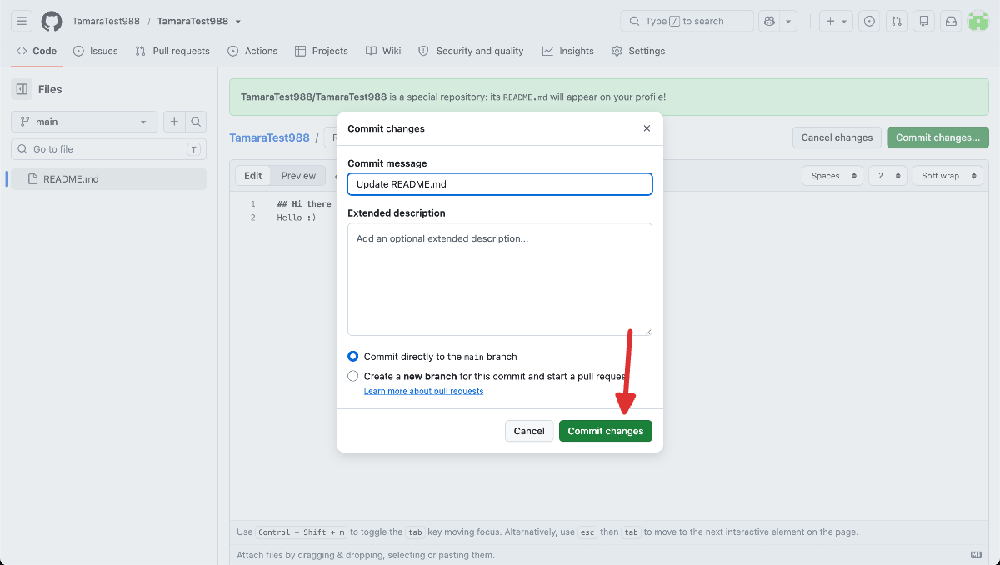
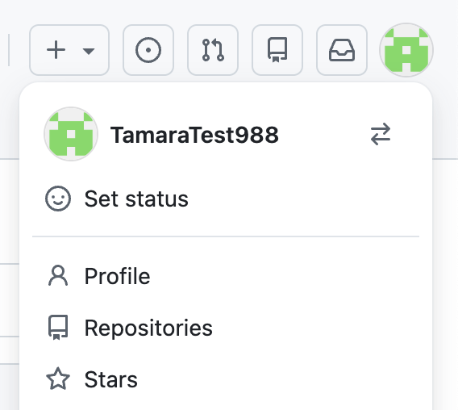
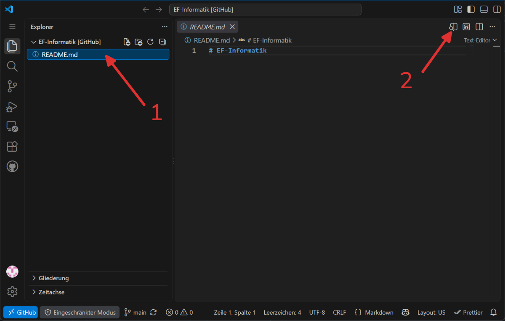

import ProgressState from '@tdev-components/documents/ProgressState';
import Steps from '@tdev-components/Steps';
import ChoiceAnswer from '@tdev-components/documents/Assessable/ChoiceAnswer';
import Quiz from '@tdev-components/documents/Assessable/Quiz';
import { points, multipleChoicePoints, noPoints } from '@tdev-components/documents/Assessable/helpers/scoring';
import Dir from '@tdev-components/FileSystem/Dir';
import { unifyPath } from "@tdev-components/documents/String/sanitizers";


# Markdown
Code-Dokumentation werden bei Code-Projekten standardmässig im Markdown-Format verfasst - eine Markup Langauge, welche weniger explizite Steuerzeichen als etwa HTML braucht aber bspw. Code-Blöcke gut darstellen kann.

:::info[Diese Seite...]
Nice to know: Das gesamte Unterrichts-Material unserer EF-Seite ist in Markdown geschrieben 😎.
:::

::::aufgabe[Tutorial]
<Answer type="state" id="c80c4159-2341-48bf-8851-f047c58b9057" />

Bearbeiten Sie das Tutrial inkl. der Übungen zu Markdown auf der Seite

https://commonmark.org/

und markieren Sie die Aufgabe anschliessend als erledigt.

:::danger[Achtung]
Im Tutorial wird eine Möglichkeit gezeigt, wie man neue Zeilen macht. Verwenden Sie die Option mit zwei Leerschlägen am Ende der Zeile, so dass Ihre Markdowns die grösstmögliche Kompatibilität aufweisen - ein `\` wird nicht immer unterstüzt.
:::
::::

### Bilder und Relative Pfade

Im Tutorial haben Sie gesehen, dass man Bilder einfach einbinden kann - allerdings braucht es dazu nicht unbedingt ein Online-Bild mit einer `https://`-Adresse, sondern wir können auch ganz einfach Bilder aus unserem Projektordner einbinden. Dazu müssen wir die Bilder in einen Unterordner (z.B. `images`) speichern und dann den Pfad zu diesem Bild angeben.

Dazu kurz etwas Theorie zu relativen Pfaden:

In der Informatik werden Pfade oft auch relativ zu einem Verzeichnis angegeben. Dabei werden
- wie üblich Ordnernamen und Dateien mit einem Slash `/` getrennt.
- Ein `.` steht für das aktuelle Verzeichnis - ausgehend von der aktuell betrachteten Datei.
- Ein `..` steht für das übergeordnete Verzeichnis - ausgehend von der betrachteten Datei der übergeordnete Ordner.

::::info[Beispiel]
:::cards
::br{flexGrow=0 flexBasis=220px}
<Dir 
  open
  noSelect 
  dir={{
    name: 'www',
    children: [
      {
        name: 'static',
        children: [
          'logo.png 👈'
        ]
      },
      {
        name: 'webseite',
        children: [
        'README.md 🟢',
        { 
          name: 'images',
          children: [
            'blume.png ',
            'sonne.jpg 👈'
          ]
        }
      ]}
    ]
  }}
/>
::br{flexBasis=300px}

Ausgehend von `README.md` (🟢) ist der relative Pfad
- zu `sonne.jpg` (👈) `./images/sonne.jpg`
- zu `logo.png` (👈) `../static/logo.png`
:::
Die Markdown-Syntax ausgehend von `README.md` wäre dann

```md


```
::::
::::aufgabe[Relative Pfade]
<Answer type="state" id="4e3fdc24-5818-445b-a419-d4549dc0e7cc" />

Geben Sie für folgende Pfade von der aktuellen Datei (🟢 oder 🟠) zum Ziel (👈) die korrekten relativen Pfade (nur die Pfade, nicht die Markdown-Syntax) an:

:::cards{flexBasis=300px}

<Dir 
  open
  noSelect 
  dir={{
    name: 'webseite',
    children: [
      'index.txt 🟢',
      {
        name: 'images',
        children: [
          'blume.png',
          'sonne.jpg 👈'
        ]
      }
    ]
  }}
/>
<Answer type="string" id="cd6cf6ce-51d7-4c50-9e3a-ebba155eb69e" label="🟢" solution="./images/sonne.jpg" sanitizer={unifyPath} />

::br

<Dir 
  open
  noSelect 
  dir={{
    name: 'webseite',
    children: [
      'index.html 🟢',
      {
        name: 'pages',
        children: [
          'about.txt 🟠',
          'cv.txt',
          {
            name: 'images',
            children: [
              'me.png 👈'
            ]
          }
        ]
      }
    ]
  }}
/>
<Answer type="string" id="461aecf6-7a9b-4c48-b7d5-e188a6cb9d74" label="🟢" solution="./pages/images/me.png" sanitizer={unifyPath} />
<Answer type="string" id="1639b223-96f3-4063-a31f-46ca7692ff35" label="🟠" solution="./images/me.png" sanitizer={unifyPath} />

::br
<Dir 
  open
  noSelect 
  dir={{
    name: 'webseite',
    children: [
      'index.txt',      
      { 
        name: 'images',
        children: [
          'blume.png 👈',
          'sonne.jpg'
        ]
      },
      {
        name: 'pages',
        children: [
          'about.txt',
          'cv.txt 🟢'
        ]
      }
    ]
  }}
/>
<Answer type="string" id="02024975-4189-4c0f-af88-8ac19ef2924b" label="🟢" solution="../images/blume.png" sanitizer={unifyPath} />
:::

::::

## GitHub: Sneak Peak
Um unseren Code zu versionieren und synchronisieren, verwenden wir GitHub. Github ist aktuell der Quasi-Standard für Open Source Software und bietet Entwicklern kostenlos die Möglichkeit, sogenannte **Repositories** zu erstellen. Zu diesem Begriff später mehr.

Im Kickoff-Meeting vor den Sommerferien haben Sie bereits ein GitHub-Konto erstellt.

::::aufgabe[Steckbrief Light]
In dieser Aufgabe fügen Sie Ihrem GitHub-Profil einen kleinen Steckbrief hinzu.

<ProgressState id="cde2294d-ebe8-45ad-8a8a-bdf16278546d">
  1. Loggen Sie sich auf https://github.com/ mit Ihrem vor den Ferien erstellten GitHub-Konto ein.
  2. Erstellen Sie ein neues Repository:
     
  3. Der Name des Repositorys soll genau Ihrem GitHub-Namen entsprechen (weil es sich hier um ein besonderes Repository handelt). Zudem soll die Option __Add README__ aktiviert sein.
     
  4. Nun ist Ihr "Profil-Repository" (gleicher Name wie Ihr GitHub-Username) erstellt und es wurde bereits eine Datei namens `README.md` hinzugefügt. Alles, was Sie in diese Datei reinschreiben (inkl. Bilder) erscheint in Ihrem öffentlichen Profil.<br/>
     Klicken Sie auf das Bleistift-Icon, um die `README.md`-Datei zu bearbeiten.
     
  5. In diesem Editor können Sie nun mit **Markdown**-Syntax einen Steckbrief (mit Hobbies, Lieblings-Games, Lieblingsfilmen, Lieblingsessen, etc.) erstellen. **Achtung:** Alle Angaben sind in Ihrem öffentlichen Profil sichtbar. 
     Sobald Sie mit Ihrem Steckbrief zufrieden sind, können Sie Ihre Änderung mit dem Button __Commit changes…__ speichern.
     
     Lassen Sie alle Einstellungen unverändert und klicken Sie erneut auf __Commit changes…__.
     
  6. Sehen Sie sich Ihr Profil an, indem Sie oben rechts auf Ihr Profilbild und dann auf __Profile__ klicken.
     
     Ihr Steckbrief sollte jetzt hier ersichtlich sein.
     
     Ihr öffentliches Profil ist auch über die URL https://github.com/Ihr_GitHub_Username (also z.B. https://github.com/TamaraTest988) aufrufbar.
  7. Wenn Sie an Ihren Steckbrief noch etwas anpassen wollen, können Sie direkt in Ihrem Profil beim Steckbrief (`README.md`) auf das Bleistift-Icon klicken. Alternativ können Sie auch jederzeit über die Repositories-Übersicht zu Ihren Profil-Repository zurückkehren und dort dann die Datei `README.md` anklicken, um sie zu bearbeiten.
     
</ProgressState>
::::

:::aufgabe[Markdown-Quiz]
<Quiz scoring={points(1)} randomizeQuestions randomizeOptions id="7eb77ae5-4c8c-4d24-857a-0064f9a3c862">
   <ChoiceAnswer correct={[3]} title="Überschriften in Markdown">
      > Wie erzeugt man in Markdown eine Überschrift der Stufe 2?

      1. `# Überschrift`
      2. `--- Überschrift`
      3. `## Überschrift`
      4. `<h2>Überschrift</h2>`
      5. `**Überschrift**`
   </ChoiceAnswer>

   <ChoiceAnswer correct={[2, 4]} title="Fetten Text erzeugen">
      > Mit welcher Schreibweise wird Text in Markdown **fett** dargestellt?

      1. `_Text_`
      2. `**Text**`
      3. `*Text*`
      4. `__Text__`
      5. `~~Text~~`
   </ChoiceAnswer>

   <ChoiceAnswer correct={[1, 3]} title="Kursiven Text erzeugen">
      > Mit welcher Schreibweise wird Text in Markdown *kursiv* dargestellt?

      1. `*Text*`
      2. `**Text**`
      3. `_Text_`
      4. `__Text__`
      5. `` `Text` ``

      **Gewusst?** Ein einzelnes Sternchen bzw. ein einzelner Unterstrich steht für kursiv, doppelt gesetzt für fett.
   </ChoiceAnswer>

   <ChoiceAnswer correct={[4]} title="Links einfügen">
      > Wie fügt man in Markdown einen Link zur Seite `https://www.gbsl.ch` mit dem sichtbaren Text „Schulwebsite“ ein?

      1. `[https://www.gbsl.ch](Schulwebsite)`
      2. `{Schulwebsite}(https://www.gbsl.ch)`
      3. `<Schulwebsite, https://www.gbsl.ch>`
      4. `[Schulwebsite](https://www.gbsl.ch)`
      5. `(Schulwebsite)[https://www.gbsl.ch]`
   </ChoiceAnswer>

   <ChoiceAnswer correct={[3]} title="Bilder einfügen">
      > Welche Syntax verwendet man in Markdown, um ein Bild mit dem Alternativtext „Logo“ und der Datei `logo.png` einzufügen?

      1. `[Logo](logo.png)`
      2. `logo.png</img>`
      3. ``
      4. `{Logo: logo.png}`
      5. `#Logo(logo.png)`

      **Gewusst?** Das Ausrufezeichen `!` vor der eckigen Klammer ist der einzige Unterschied zwischen einem Link und einem Bild!
   </ChoiceAnswer>

   <ChoiceAnswer correct={[3]} title="Bilder aus Unterordnern referenzieren">
      > Du schreibst eine Markdown-Datei `bericht.md`. Im selben Verzeichnis befindet sich der Ordner `images`, darin liegt die Datei `diagramm.png`. Die folgende Dateistruktur zeigt die Ordnerhierarchie:

      ```
      projekt/
      ├── bericht.md
      └── images/
         └── diagramm.png
      ```

      Mit welcher Zeile bindest du `diagramm.png` korrekt in `bericht.md` ein?

      1. ``
      2. ``
      3. ``
      4. ``
      5. ``
   </ChoiceAnswer>

   <ChoiceAnswer correct={[5]} title="Relative Pfade bei verschachtelten Ordnern">
      > Gegeben sei diese Dateistruktur:

      ```
      projekt/
      ├── kapitel/
      │   └── einleitung.md
      └── medien/
         └── foto.jpg
      ```

      Wie muss der Bildpfad in `einleitung.md` lauten, damit `foto.jpg` korrekt angezeigt wird?

      1. ``
      2. ``
      3. ``
      4. ``
      5. ``

      **Gewusst?** Zwei Punkte `..` bedeuten „eine Ordnerebene nach oben“ - genau wie bei Pfadangaben in der Kommandozeile.
   </ChoiceAnswer>

   <ChoiceAnswer correct={[2]} title="Zitate (Blockquotes)">
      > Wie erzeugt man in Markdown ein Zitat wie dieses hier?
      >
      > „Markdown ist einfach zu lernen.“

      1. `"Markdown ist einfach zu lernen."`
      2. `> Markdown ist einfach zu lernen.`
      3. `## Markdown ist einfach zu lernen.`
      4. `~ Markdown ist einfach zu lernen.`
      5. `« Markdown ist einfach zu lernen. »`
   </ChoiceAnswer>

   <ChoiceAnswer correct={[1]} title="Inline-Code">
      > Wie schreibt man das Wort `print` so, dass es im Text als Code hervorgehoben wird (also mit fester Schriftbreite und Hintergrund)?

      1. `` `print` ``
      2. `**print**`
      3. `[print]`
      4. `<print>`
      5. `~print~`
   </ChoiceAnswer>

   <ChoiceAnswer correct={[1]} title="Mehrzeilige Code-Blöcke">
      > Mit welchen Mitteln lässt sich in Markdown ein **mehrzeiliger** Python-Code-Block erzeugen?

      1. Der Codeabschnitt wird oben und unten mit drei Backticks ` ``` ` eingerahmt:
         ````
         ```py
         ...
         ```
         ````
      2. Der Codeabschnitt wird oben und unten mit drei Sternchen `***` eingerahmt.
         ````
         ***py
         ...
         ***
         ````
      4. Der Codeabschnitt wird in einfache Anführungszeichen `'...'` gesetzt.
         
         ````
         ...py
         ...
         ...
         ````
      5. Der Codeabschnitt wird in geschweifte Klammern `{...}` gesetzt.
         ````
         {
         ...
         }
         ````
   </ChoiceAnswer>

   <ChoiceAnswer correct={[1, 2, 5]} multiple title="Allgemeines zu Markdown">
      > Welche Aussagen zu Markdown sind korrekt? Es sind **mehrere** Antworten möglich.

      1. Markdown-Dateien haben üblicherweise die Endung `.md`.
      2. Markdown wurde entwickelt, um Text auch ohne Rendering gut lesbar zu halten.
      3. In Markdown muss jede Datei mit einer Überschrift der Stufe 1 (`#`) beginnen.
      4. Markdown kann direkt zu HTML umgewandelt werden.
      5. Innerhalb von Markdown-Dokumenten ist es üblich, auch reines HTML zu verwenden, falls Markdown nicht ausreicht.
   </ChoiceAnswer>
</Quiz>
:::

## EF Repository

Obiges Repository muss öffentlich sein und dient als Willkommensseite auf Ihrem Github-Profil. Für das EF-Informatik erstellen wir nun aber ein separates Repository, um über Code zu schreiben (und später auch den geschriebenen Code hochzuladen). Bei diesem Repository entscheiden Sie selbst, ob es öffentlich oder privat ist - Sie können dies zu einem späteren Zeitpunkt auch noch ändern.

<Steps>
1. Erstellen Sie ein neues Repository mit dem Namen `EF-Informatik` und aktivieren Sie die Option __Add README__.
2. Ändern Sie in der URL die `github.com` zu `github.dev` (z.B. von `https://github.com/bh0fer/EF-Informatik` zu `https://github.dev/bh0fer/EF-Informatik`) und drücken Sie Enter. Es öffnet sich eine Web-Version von VS Code, in welcher Markdown-Dateien praktisch bearbeitet werden können.  
   :::info[Berechtigun]
   Um ein Repository im Webeditor zu öffnen, müssen Sie allenfalls beim erstmaligen Öffnen eine Berechtigung für den Zugriff auf Ihr Repository  annehmen.
   :::
3. Vorschau öffnen  
   Im Webeditor kann auch eine Live-Vorschau der Markdown-Datei geöffnet werden - Sie sehen immer live, wie Ihre Änderungen in der Datei aussehen werden.

   

</Steps>

### Steckbrief
:::aufgabe[Persönlicher Steckbrief]
<Answer type="state" id="4aee37f4-277f-4402-90bf-a821ca9623f4" />

Erstellen Sie nun einen etwas persönlicheren Steckbrief, der 
- min. ein Bild enthält,
- min. 3 Unterüberschriften aufweist,
- einen kurzen Einblick zu Ihnen gibt (Hobbies, Codeprojekte, Lieblingsbücher, Lieblingsfächer, Léieblingsvereine, Lieblingsessen, Lieblingsmusik, Lieblings...?).

Bilder können Sie per Drag&Drop in den Webeditor ziehen.

Achten Sie darauf, alle Bilder in einen neuen Ordner `images` zu speichern. 

Sie können sich für Ihren Steckbrief auch an unseren Steckbriefen orientieren:
   - [bh0fer/EF-Informatik](https://github.com/bh0fer/EF-Informatik)
   - [SilasBerger/EF-Informatik](https://github.com/SilasBerger/EF-Informatik)

Um die veränderten/neuen Dokumente zu speichern, müssen Sie wie folgt vorgehen:

::video[./images/github-stage-commit-push.mp4]

Halten Sie zudem die URL zu Ihrem Repository in der folgenden Antwortbox fest.

<Answer type="string" label="URL zum EF-Repository" inputWidth="30em" id="f2e01997-51e8-46a8-b340-77dc0f281a2d" />

:::

### Erster Report

::::aufgabe[Erster Report]
<Answer type="state" id="34c632e3-577a-4115-a2df-2137c35b4ff7" />

Setzen Sie die folgende Struktur in Ihrem EF-Repository auf, um auch über unseren Code zu berichten.

Erstellen/Ergänzen Sie dazu folgende Ordnerstruktur:

```
EF-Informatik/
├── docs/
│   ├── images/
│   └── 01-einstieg.md
├── images/
└── README.md
```

1. Halten Sie im Dokument __01-Einstieg.md__ einen Erfahrungsbericht zu den bisherigen Aufgaben fest. Darin können Sie
   - einzelne neu gelernte Dinge
   - Stolpersteine
   - Tipps und Tricks
   - etc. festhalten.
2. Stellen Sie sicher, dass Sie in Ihrem Bericht sowohl **Python-Formatierte Codeblocks** wie auch **inline-Code** verwenden.
3. Laden Sie die Änderungen so hoch, wie im Video weiter oben gezeigt.
4. Markieren Sie die Aufgabe als erledigt.

Eine mögliche, *nicht vollständige*, Vorlage für einen ersten Report finden Sie hier: [docs/01-einstieg.md](https://github.com/bh0fer/EF-Informatik/blob/main/docs/01-einstieg.md)

:::info[Leere Ordner]
Falls Sie der Ordner __EF-Informatik/docs/images__ leer ist, wird dieser Ordner nicht direkt in GitHub erstellt. Dies ist eine Speicherplatzoptimierung von Git.
:::
::::

