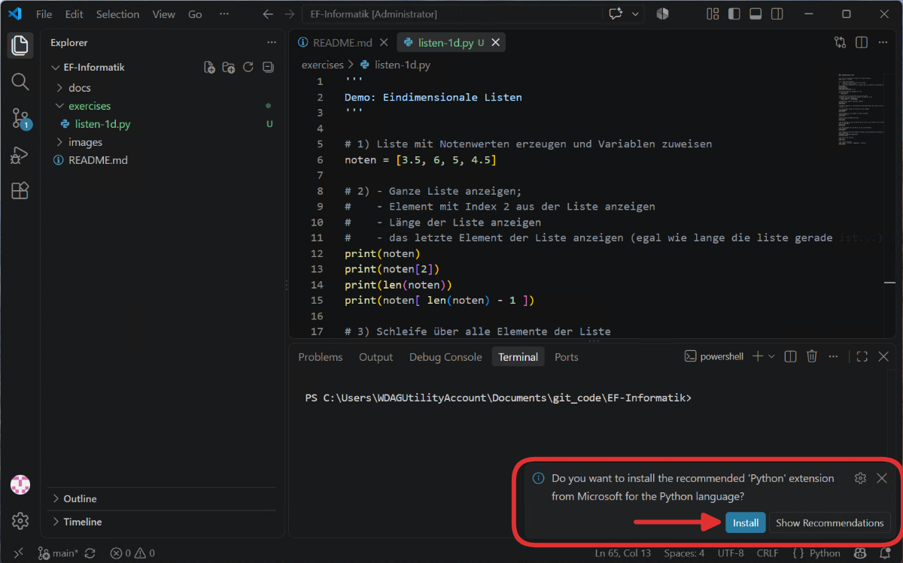
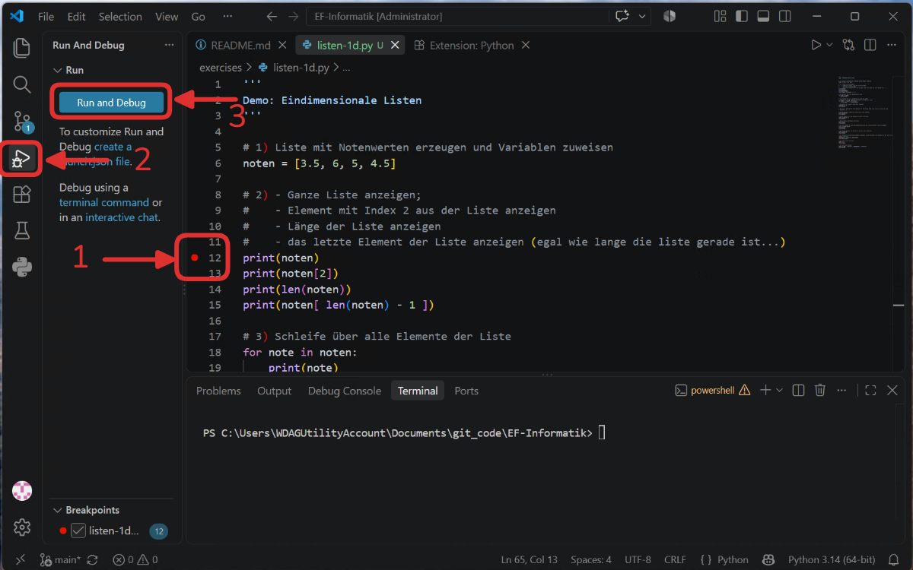
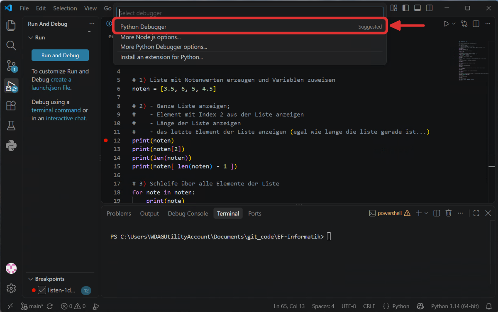
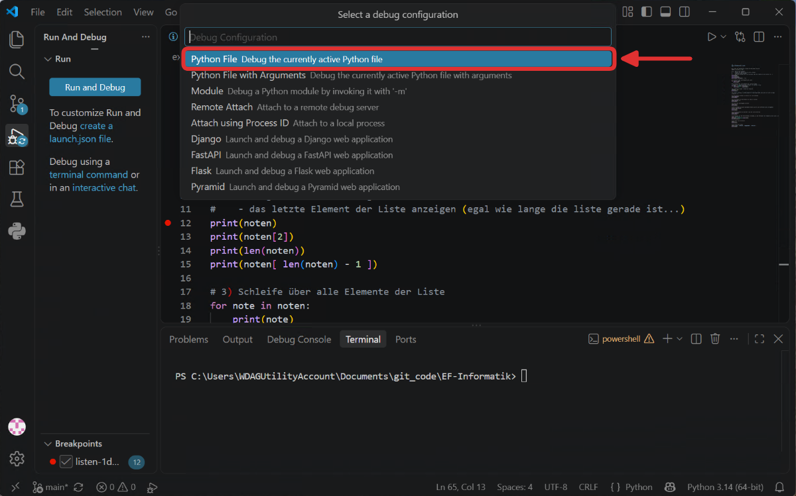
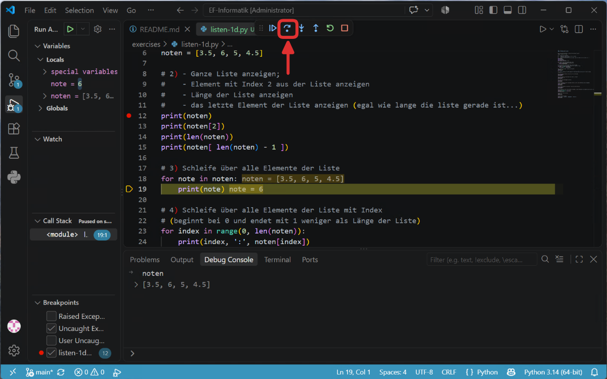

---
sidebar_custom_props:
  source:
    name: sdg
    ref: 'https://gitlab.gbsl.website/gymbefin23/material/-/snippets/11'
page_id: ad4d9802-8e3b-4706-bf2f-b6cac09a6cbd
---
import Strukto from '@tdev-components/Strukto';
import CodeBlock from '@theme/CodeBlock';
import Steps from '@tdev-components/Steps';
import ChoiceAnswer from '@tdev-components/documents/Assessable/ChoiceAnswer';
import Quiz from '@tdev-components/documents/Assessable/Quiz';
import { points, multipleChoicePoints, noPoints } from '@tdev-components/documents/Assessable/helpers/scoring';

# Listen 1D

Zum Speichern von **mehreren Werten** unter einem **einzigen Namen** verwendet man in Python Listen. Man kann sich __Listen__ als Tabellen mit einer Spalte vorstellen. Die Zellen in der Tabelle werden als **Elemente** bezeichnet und sind durchnummeriert. So kann man einzelne in der Liste gespeichert Werte unterscheiden. Die Nummer eines Elements wird als dessen **Index** bezeichnet.

:::important[Wichtig]
- Das erste Element in der Liste trägt den Index 0.
- Der Index des letzten Elementes ist die Länge der Liste minus 1.
:::

Das folgende Bild illustriert dies für eine Liste mit 4 Noten. Die **Länge** der Liste ist **4**, das letzte Element trägt den **Index 3**.

Index
: 　**Wert**
`0`
: :mdi[arrow-right-thin] `4.5`
`1`
: :mdi[arrow-right-thin] `5`
`2`
: :mdi[arrow-right-thin] `3.5`
`3`
: :mdi[arrow-right-thin] `5.5`

In Python kann man diese Liste wie folgt erzeugen:

```py live_py slim
noten = [4.5, 5, 3.5, 5.5]
print('Die vierte Note war eine', noten[3])
```

Im Beispiel wird die vierte Note mit dem Index `3` ausgegeben.

## Aufgaben

### Debuggen

Der Debug-Modus ermöglicht es, ein Programm Zeile für Zeile auszuführen und den aktuellen Zustand der Variablen zu untersuchen. Dies ist besonders hilfreich, um einerseits den Ablauf des Programms zu verstehen und andererseits Fehler im Code zu finden.

<Steps>
1. Öffnen Sie ein Python-Programm in VS Code - beim **erstmaligen Öffnen** wird VS Code fragen, ob Sie die Python-Erweiterung installieren möchten. Bestätigen Sie dies.
    
2. :mdi[numeric-1-circle-outline]{.red} Setzen Sie einen **Haltepunkt** (Breakpoint) in der Zeile, die Sie untersuchen möchten, indem Sie links neben die Zeilennummer klicken.  :mdi[numeric-2-circle-outline]{.red} Klicken Sie auf die Schaltfläche **Run and Debug** in der linken Seitenleiste und danach  :mdi[numeric-3-circle-outline]{.red} auf den **Debug**-Knopf.
    
3. Wählen Sie `Python Debugger` aus.
    
4. Wählen Sie `Python File`.
    
5. Das Programm hält nun beim gesetzten Breakpoint an. In der Seitenliste links können Sie alle Veriablen inspizieren. Im Reiter __Debug Console__ können Sie zudem Python-Code direkt ausprobieren - alle Variablen und Funktionen, die beim aktuellen Haltepunkt definiert sind, können Sie hier verwenden.
    
6. Mit der Schaltflächen **Step Over** :mdi[debug-step-over]{.blue} können Sie das Programm Zeile für Zeile ausführen. Mit **Continue** :mdi[step-forward]{.blue} wird das Programm bis zum nächsten Haltepunkt ausgeführt.
    
</Steps>


::::aufgabe[1. listen-1d.py]
<Answer type="state" id="ec010329-3a79-4bd3-8e8d-35be2c5d246e" />
import list1d from '!!raw-loader!./assets/listen-1d.py';

Dateiname
: __EF-Informatik/exercises/listen-1d.py__


1. Erstellen Sie das folgende Programm in Ihrem Repository  
   :::details[Programm]
   <CodeBlock language="py" showLineNumbers={true} title="listen-1d.py">
   {list1d}
    </CodeBlock>
   :::
2. Führen Sie das Programm Zeile für Zeile (mit dem Debugger) aus und untersuchen Sie die verschiedenen Listen-Optionen.
3. Setzen Sie einen Breakpoint vor dem auskommentierten *Szenario 6* und führen Sie die __Zeile 31__ in der __Debug Konsole__ aus. Welche Ausgabe erhält man?
   <Answer type="text" id="bcb8dfa2-c31f-4fa2-b2a8-b368e884687f" />

4. Fügen Sie die Änderungen hinzu und pushen Sie sie in Ihr Repository.
::::

## Eindimensionale Listen

Hier nochmals in der Übersicht die Funktionsweise von Listen in Python.

:::def[Liste erzeugen `[]`]
```py live_py slim
# Liste erzeugen und Variablen zuweisen
noten = [3.5, 6, 5, 4.5]

# Ganze Liste anzeigen 
print(noten)
# Element mit Index 2 aus der Liste anzeigen
print(noten[2])
```
:::

:::def[Schleife über alle Elemente der Liste]
```py live_py slim
noten = [3.5, 6, 5, 4.5]

for note in noten:
    print(note)
```
:::

:::def[Schleife über Listen-Indices]
```py live_py slim
noten = [3.5, 6, 5, 4.5]

# (beginnt bei 0 und endet mit 1 weniger als Länge der Liste)
for index in range(0, len(noten)):
    print(index, ":", noten[index])
```
:::

:::def[Listenelemente ändern]
```py live_py slim
noten = [3.5, 6, 5, 4.5]

# Element mit Index 3 neuen Wert zuweisen
noten[3] = 5.5
print(noten)
```
:::

:::def[Fehler: IndexError]
```py live_py slim
noten = [3.5, 6, 5, 4.5]

# die Liste ist nicht so lang
noten[7] = 6
```
:::

:::def[Element hinzufügen `append()`]
```py live_py slim
noten = [3.5, 6, 5, 4.5]

# Element am Ende der Liste anhängen
noten.append(5)
print(noten)
```
:::

:::def[Element an bestimmter Stelle hinzufügen `insert()`]
```py live_py slim
noten = [3.5, 6, 5, 4.5, 5]
# vor dem Element mit Index 3 eine "4" einfügen
noten.insert(3, 4)
print(noten)
```
:::

:::def[Aufsteigend sortieren `sort()`]
```py live_py slim
noten = [3.5, 6, 5, 4, 4.5, 5]

noten.sort()
print(noten)
```
:::

:::def[Letztes Element entfernen `pop()`]
Letztes Element entfernen und zurückgeben.
```py live_py slim
noten = [3.5, 4, 4.5, 5, 5, 6]

last = noten.pop()
print(last)
print(noten)
```
:::

:::def[Element bei Index entfernen `pop(0)`]

```py live_py slim
vorderstes = noten.pop(0)
print(vorderstes)
print(noten)
```
:::
:::def[Element aus der Liste entfernen `remove()`]

```py live_py slim
noten = [3.5, 5, 4.5, 4, 5, 6]

# 11) Erstes Element mit dem Wert 5 aus der Liste entfernen
noten.remove(5)
print(noten)
```
:::

:::def[Mittelwert `statistics.mean()`]

```py live_py slim
import statistics

noten =[3.5, 5, 4.5, 4, 5, 6]

mittelwert = statistics.mean(noten)
print(mittelwert)
```

Weitere Funktionen

https://docs.python.org/3/library/statistics.html
:::

:::def[Leere Liste `[]`]
```py live_py slim
# Leere Liste erstellen
noten = []
print(noten)
```
:::
:::def[Liste mit Text]
```py live_py slim
# Liste mit Strings
noten =['gut', 'erfüllt', 'mangelhaft', 'erfüllt']
print(noten)
```
:::

## Fragen

<Quiz scoring={points(1)} randomizeQuestions randomizeOptions id="a3cfcf4e-0711-4afe-8644-77a43f8f5b29">
<ChoiceAnswer correct={[1]}>
    > Welchen Index trägt das erste Element einer Liste in Python?

    1. `0`
    2. `1`
    3. Die Länge der Liste
    4. `-1`
</ChoiceAnswer>

<ChoiceAnswer correct={[3]}>
    > Die Liste `noten = [4.5, 5, 3.5, 5.5]` hat die Länge 4. Welchen Index trägt das letzte Element?

    1. `4`
    2. `0`
    3. `3`
    4. `5`
</ChoiceAnswer>

<ChoiceAnswer correct={[2]}>
    > Was gibt der folgende Code aus?
    ```py
    noten = [3.5, 6, 5, 4.5]
    noten.insert(1, 3)
    print(noten[3])
    ```

    1. `3.5`
    2. `5`
    3. `6`
    4. `4.5`
</ChoiceAnswer>

<ChoiceAnswer correct={[1, 3]} multiple scoring={multipleChoicePoints(1, 1)}>
    > Welche der folgenden Aussagen zu Listen in Python sind korrekt? Es sind **mehrere** Antworten möglich.

    1. Man kann sich eine Liste als Tabelle mit einer Spalte vorstellen.
    2. Der Index des letzten Elements entspricht der Länge der Liste.
    3. `len(noten)` gibt die Anzahl der Elemente der Liste `noten` zurück.
    4. Alle Elemente einer Liste müssen nach der Grösse sortiert angegeben werden.
</ChoiceAnswer>

<ChoiceAnswer correct={[4]}>
    > Mit welchem Ausdruck erhält man **immer** das letzte Element einer Liste `noten`, unabhängig von deren Länge?

    1. `noten[-0]`
    2. `noten[len(noten)]`
    3. `noten[4]`
    4. `noten[len(noten) - 1]`
</ChoiceAnswer>

<ChoiceAnswer correct={[2]}>
    > Welcher Fehler tritt beim Ausführen der folgenden Codezeile auf?

    ```py
    noten = [3.5, 6, 5, 4.5]
    noten[7] = 6
    ```

    1. `TypeError`
    2. `IndexError`
    3. `ValueError`
    4. Es gibt keinen Fehler.
</ChoiceAnswer>

<ChoiceAnswer correct={[3]}>
    > Mit welcher Methode fügt man ein Element am **Ende** einer Liste hinzu?

    1. `noten.insert()`
    2. `noten.add()`
    3. `noten.append()`
    4. `noten.push()`
</ChoiceAnswer>

<ChoiceAnswer correct={[1]}>
    > Was bewirkt der Aufruf `noten.insert(3, 4)`?

    1. Der Wert `4` wird an der Stelle mit Index `3` eingefügt, alle nachfolgenden Elemente rücken auf.
    2. Der Wert `3` wird an der Stelle mit Index `4` eingefügt.
    3. Das Element mit Index `3` wird durch den Wert `4` ersetzt.
    4. Der Wert `4` wird ans Ende der Liste angehängt.
</ChoiceAnswer>

<ChoiceAnswer correct={[2, 4]} multiple scoring={multipleChoicePoints(1, 1)}>
    > Gegeben sei `noten = [3.5, 4, 4.5, 5, 5, 6]`. Welche der folgenden Aussagen sind korrekt? Es sind **mehrere** Antworten möglich.

    1. `noten.pop()` entfernt und liefert das **erste** Element der Liste.
    2. `noten.pop()` entfernt und liefert das **letzte** Element der Liste.
    3. `noten.remove(5)` entfernt **alle** Elemente mit dem Wert `5`.
    4. `noten.remove(5)` entfernt das **erste** Element mit dem Wert `5`.
</ChoiceAnswer>
</Quiz>