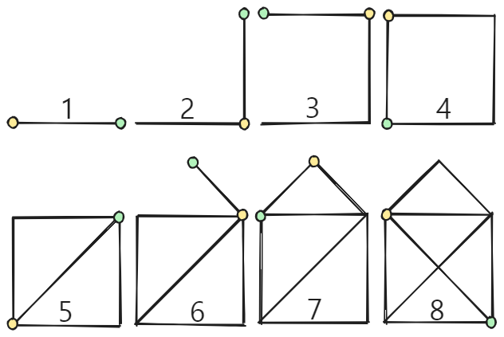
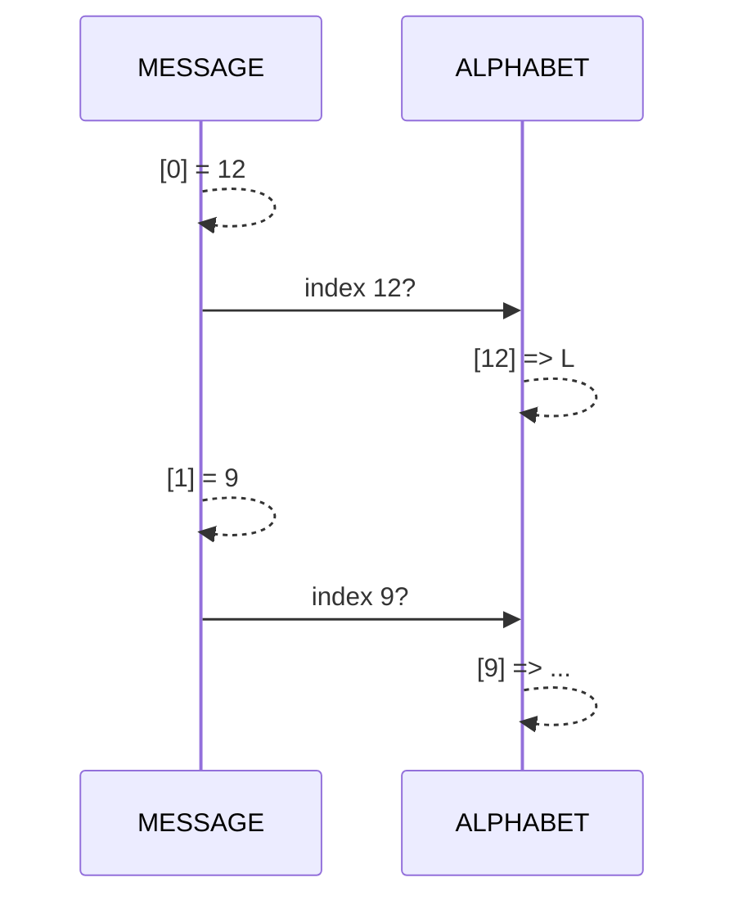
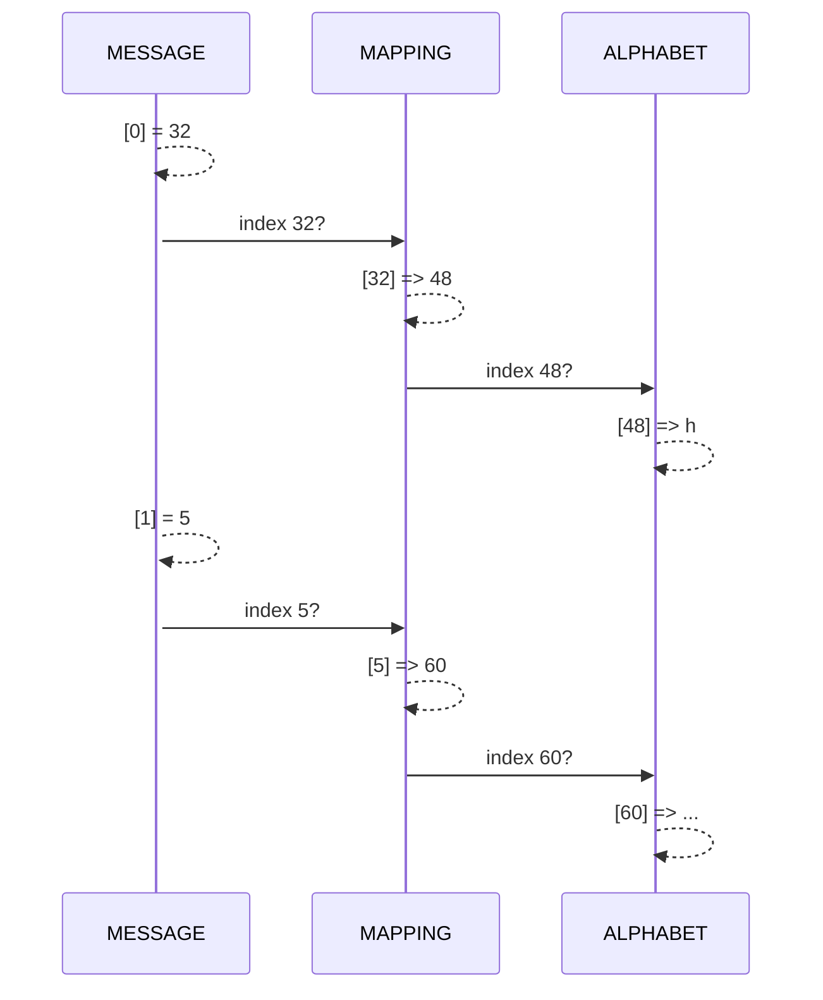

import Strukto from '@tdev-components/Strukto'
import QuillV2 from '@tdev-components/documents/QuillV2'

# Weitere Aufgaben
In diesem Abschnitt finden Sie weitere Aufgaben und Challenges, mit denen Sie den Umgang mit 1D- und 2D-Listen weiter üben und vertiefen können.

::::aufgabe[Haus vom Nikolaus]
<Answer type="state" id="b25ca0bb-748f-46e4-b99a-b596a9ae4363" />
Vermutlich haben Sie mit der Turtle schon einmal ein "Haus vom Nikolaus" programmiert. Hier zur Erinnerung der Algorithmus dazu:



Die Challenge: Schaffen Sie es, diese Zeichnung mit **maximal 5 Zeilen Code** (inkl. `from turtle import *`) zu erstellen?

:::tip[Listen]
Listen sind ein nützliches Werkzeug für diese Aufgabe.
:::

```py live_py id=a58e26d5-5b53-46ad-a8ec-69faef3cb95d
```
::::

:::aufgabe[Haus vom Nikolaus (noch kürzer)]
<Answer type="state" id="a44db9ef-1779-4205-b522-e163c3aefd33" />

Falls Sie das nicht bereits so gemacht haben: Schaffen Sie es auch mit nur **3 Zeilen Code**?

```py live_py id=60a55db8-3485-4f17-a5b5-91c85f5528bf
```
:::

:::aufgabe[Was steht geschrieben?]
<Answer type="state" id="308988a2-b886-48c7-aedf-851bafad4653" />

Dateiname
: __EF-Informatik/exercises/listen-word-riddle.py__

Gegeben ist ein `ALPHABET` und eine Nachricht `MESSAGE`. In der Nachricht sind die Indices der zugehörigen Buchstaben gespeichert. Schreiben Sie ein Programm, welches die Nachricht decodiert und in Buchstabenform darstellt.

```py
ALPHABET = [' ', 'A', 'B', 'C', 'D', 'E', 'F', 'G', 'H', 'I', 'J', 'K', 'L', 'M', 'N', 'O', 'P', 'Q', 'R', 'S', 'T', 'U', 'V', 'W', 'X', 'Y', 'Z']
MESSAGE = [12, 9, 19, 20, 0, 18, 9, 4, 4, 12, 5]
```

:::tip

:::

::::aufgabe[Meine Nummer 1]
<Answer type="state" id="20702dce-4ff3-4254-8fc8-6181ecd7e7e1" />

Dateiname
: __EF-Informatik/exercises/listen-word-riddle2.py__

Nun wurde eine weitere Zuordnungsstufe hinzugefügt 😮. In der `MESSAGE` steht, an welcher Stelle im `MAPPING` der Index steht, an welchem der gesuchte Buchstabe zu finden ist. Finden Sie die Nachricht?

```py
ALPHABET = [' ', '_', '.', ':', '/', '0', '1', '2', '3', '4', '5', '6', '7', '8', '9', 'A', 'B', 'C', 'D', 'E', 'F', 'G', 'H', 'I', 'J', 'K', 'L', 'M', 'N', 'O', 'P', 'Q', 'R', 'S', 'T', 'U', 'V', 'W', 'X', 'Y', 'Z', 'a', 'b', 'c', 'd', 'e', 'f', 'g', 'h', 'i', 'j', 'k', 'l', 'm', 'n', 'o', 'p', 'q', 'r', 's', 't', 'u', 'v', 'w', 'x', 'y', 'z']
MAPPING = [54, 58, 53, 4, 8, 60, 45, 60, 12, 41, 13, 47, 60, 4, 44, 56, 62, 4, 58, 47, 41, 60, 55, 3, 9, 45, 60, 10, 19, 2, 54, 62, 48, 54, 56, 18, 41, 53, 44, 4, 58, 43, 1, 50, 54, 13, 2, 2, 49, 6, 1, 59, 14, 58, 16, 4]
MESSAGE = [32, 5, 7, 15, 51, 23, 3, 13, 48, 2, 11, 29, 14, 6, 16, 1, 9, 0, 12, 46, 41, 22, 37, 17, 38, 25, 31, 18, 20, 30, 21, 39, 40, 36, 33, 26, 55, 53, 42, 49, 8, 52, 10, 27, 4, 24, 50, 44, 54, 28, 45, 35, 47, 43, 34, 19]
```

:::tip

:::


::::tip[`print()` Optionen]
Normalerweise fügt die `print`-Funktion am Ende einer Ausgabe immer das Zeichen `\n` an, was von der Konsole als Steuerzeichen für eine neue Zeile interpretiert wird. Das können Sie aber auch ändern, indem Sie explizit vorgeben, welche Zeichen am Ende hinzugefügt werden:

:::flex{basis=380px}
```py live_py slim
# Mit Lücke zwischen einzelnen prints
for i in range(3):
    print(f'Lücke {i}', end=' ')
```
::br
```py live_py slim
# Ohne Zeichen zwischen einzelnen prints
for i in range(3):
    print(f'Ohne {i}', end='')
```
::br
```py live_py slim
# Fancy: mit Rakete und neuer Zeile zwischen einzelnen prints
for i in range(3):
    print(f'Hello {i}', end=' 🚀\n')
```
:::
::::

::::aufgabe[Primzahlen]
<Answer type="state" id="34c6769c-fec8-4570-97d8-dae19d66d8e8" />

Dateiname
: __EF-Informatik/exercises/primzahlen.py__

Schreiben Sie ein Programm welches eine Liste mit allen Primzahlen zwischen 1 und 100 erstellt und diese Liste am Schluss auf der Konsole ausgibt.

**Bevor Sie Programmieren**: Diskutieren Sie Ihr Vorgehen mit einer Kolleg:in und besprechen Sie gemeinsam eine algorithmische Lösung für das Problem. Halten Sie hier stichwortartig fest, was Sie besprochen haben.

<QuillV2 id="542b7e39-abdf-4b0c-81d8-3e61c8366560" />

<Solution id="af774a4d-bbbf-4ebb-824e-8beb8c6c0d21" title="Lösung (Algorithmus)">
<Strukto program={[
    {type: 'step', code: <span><span className="var">primes</span> = leere Liste</span>},
    {
        type: 'repeat',
        code: <span>Für alle <span className="var">zahl</span>en zwischen <u>2</u> und <u>100</u>:</span>,
        block: [
            {type: 'step', code: <span><span className="var">is_prime</span> = wahr</span>},
            {
                type: 'repeat',
                code: <span>Für alle <span className="var">test_zahl</span>en zwischen <u>2</u> und <u><span className="var">zahl</span> - 1</u>:</span>,
                block: [
                    {
                        type: 'if',
                        code: <span>Ist der ganzzahlige Rest bei der Division von <span className="var">zahl</span> durch <span className="var">test_zahl</span> gleich 0?</span>,
                        block: [
                            {type: 'step', code: <span>Setze <span className="var">is_prime</span> auf falsch.</span>}
                        ]
                    }
                ]
            },
            { 
                type: 'if', 
                code: <span>Wenn <span className="var">is_prime</span> ist wahr:</span>,
                block: [
                    {type: 'step', code: <span>Füge <span className="var">zahl</span> der Liste <span className="var">primes</span> hinzu.</span>}
                ]
            }            
        ]
    },
    {type: 'step', code: <span>Gebe die Liste <span className="var">primes</span> aus.</span>}
]} />
</Solution>
<Solution id="823633a2-0d88-4268-b0b3-561fd5a27e07" title="Lösung (Code)">
```py live_py slim
primes = []
MAX_ZAHL = 100

for zahl in range(2, MAX_ZAHL + 1):
    is_prime = True
    for to_test in range(2, zahl):
        if zahl % to_test == 0:
            is_prime = False
    if is_prime:
        primes.append(zahl)
print(f'{len(primes)} Primzahlen von 1 bis {MAX_ZAHL}', primes)
```
</Solution>

<Solution id="8699f985-ef1e-4442-93f9-a3369fed2ca9" title="Optimierungen">

```py reference title="primes.py"
https://github.com/lebalz/ofi-blog/blob/main/docs/EF-Python/03-Python/assets/primes.py
```
</Solution>
::::
