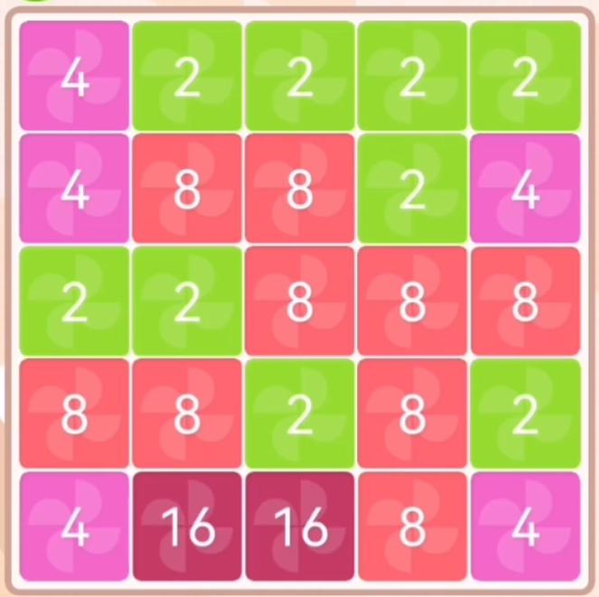

# Jetzt gehts los!



::::aufgabe[`numtrip.py`]
<Answer type="state" id="03777eff-4491-4cb4-8ac0-004777228f7b" />

Dateiname
: __EF-Informatik/numtrip/game.py__

Programmieren Sie die Datenstruktur für das Spielfeld, so wie Sie diese in der vorhergehenden Aufgabe entworfen haben.

Initialisieren Sie das Spielfeld für den Moment so, dass es einen fortgeschrittenen Spielstand eines Spiels repräsentiert, bspw. so wie im obigen Bild (mit mind. einer zweistelligen Zahl - welche Zahlen kommen in Frage??).

Damit man auch etwas sieht, wenn Sie das Programm ausführen, programmieren Sie noch die nötigen Anweisungen, welche das Spielfeld auf der Konsole anzeigt.

Überlegen Sie sich dazu, wie Sie das Spielfeld nur mit Zeichen darstellen können, so dass alle Zellen immer gleich gross sind.

Wenn alles zu Ihrer Zufriedenheit funktioniert, machen Sie einen Commit, pushen die Änderungen und markieren diese Aufgabe als erledigt.

:::danger[Noch keine Spieler:inneninteraktion]
Es ist in diesem Schritt noch keine Interaktion mit Spielenden oder ein Spielfluss zu programmieren - nur das Anzeigen des Spielfelds...
:::
::::

## Refactoring: Funktionen verwenden
::::aufgabe[Code aufräumen]

<Answer type="state" id="d90ab46d-469a-4a29-81f3-ed60f30318e2" />

- Packen Sie zunächst die Anweisungen, welche das Spielfeld auf der Konsole anzeigen aus obiger Aufgabe in eine Funktion.
- Ergänzen Sie sodann diese Funktion mit den nötigen Anweisungen so, dass am Anfang jeder Zeile die Zeilennummer steht.
- Schreiben Sie schliesslich eine weitere Funktion, welche die Spaltennummern ausgibt und rufen Sie die beiden Funktionen im Hauptprogramm auf.

:::details[Beispiel für die Konsolen-Ausgabe]
  ```
    1 2 3 4 5
    -----------
  1 |2|4|1|8|8|
    -----------
  2 |4|2|8|2|1|
    -----------
  3 |4|4|8|4|2|
    -----------
  4 |2|8|1|4|1|
    -----------
  5 |2|4|4|4|4|
    -----------
  ```
:::

Wenn alles zu Ihrer Zufriedenheit funktioniert, machen Sie ein commit und push und markieren Sie die Aufgabe als erledigt.
::::


### ⭐️ Spielfeld Farben

::::aufgabe[⭐ Optional: Spielfeld Farben]
<Answer type="state" id="5a1f3746-04b0-4845-98f2-2001e76e5214" />
Konsolen-Ausgaben können mit zusätzlichen Steuerzeichen koloriert werden - recherchieren Sie, wie das geht und färben Sie die Zahlen auf dem Spielfeld in Abhängigkeit von ihrem Wert ein (z.B. 2 = grün, 4 = gelb, 8 = rot, ...).

:::danger[Git-Hinweis]
Das Kolorieren kann einige Code-Stellen unübersichtlicher machen - stellen Sie sicher, dass Sie vor der Implementierung alle Änderungen committed haben, so dass Sie im Zweifelsfall wieder auf den letzten Stand zurückspringen können.
:::

::::