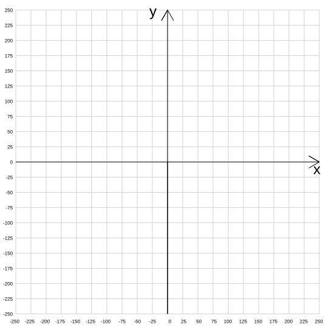

# Turtle Befehle

## Bewegungen

:::def[`forward(n)` `fd(n)`]
Bewegt die Turtle `n` Pixel nach vorne.

```py live_py slim
from turtle import *
### PRE
forward(100)
```
:::

:::def[`backward(n)` `back(n)` `bk(n)`]
Bewegt die Turtle `n` Pixel rückwärts.

```py live_py slim
from turtle import *
### PRE
backward(100)
```
:::

:::def[`left(angle)` `lt(angle)`]
Dreht die Turtle `angle` Grad nach links.

```py live_py slim
from turtle import *
### PRE
left(90)
```
:::

:::def[`right(angle)` `rt(angle)`]
Dreht die Turtle `angle` Grad nach rechts.

```py live_py slim
from turtle import *
### PRE
right(90)
```
:::

:::def[`goto(x, y)`]
Bewegt die Turtle zur Position mit den Koordinaten (`x`, `y`).

**Beispiel**: `goto(50, 100)`

```py live_py slim
from turtle import *
### PRE
goto(50, -50)
```
:::

:::def[`home()`]
Setzt die Turtle auf die Ursprungsposition `(0, 0)` zurück und setzt die Orientierung der Turtle auf rechts ▶️.

```py live_py slim
from turtle import *
speed(0)
penup()
goto(20, 30)
pendown()
left(30)
write('(20|30), 30° links', font=('Arial', 8, 'normal'))
speed(1)
### PRE
home()
```
:::

:::def[`setheading(to_angle)` `seth(to_angle)`]
Dreht die Turtle, bis der angegebene Winkel erreicht ist.

<div className="small-table">

| Winkel | Ausrichtung |
| :----- | :---------- |
| `0`    | :mdi[triangle]{rotate=90}           |
| `90`   | :mdi[triangle]           |
| `180`  | :mdi[triangle]{rotate=-90}           |
| `270` oder `90`  | :mdi[triangle-down]           |

</div>

```py live_py slim
from turtle import *
### PRE
setheading(120)
```
:::

## Stift

:::def[`penup()` `up()` `pu()`]
Hebt den Stift an - beim Bewegen der Turtle wird keine Spur gezeichnet.

```py live_py slim
from turtle import *
### PRE
penup()
forward(100)
```
:::
:::def[`pendown()` `down()` `pd()`]
Senkt den Stift - beim Bewegen der Turtle wird wieder eine Spur gezeichnet.

```py live_py slim
from turtle import *
### PRE
penup()
forward(100)
pendown()
forward(100)
```
:::
:::def[`isdown()`]
Überprüft, ob der Stift aktuell gesenkt ist und gibt das Resultat als `True` (=Stift gesenkt) oder `False` (=Stift oben) zurück.

```py live_py slim
from turtle import *
### PRE
if isdown():
    penup()
forward(100)
```
:::
:::::def[`pencolor(color)`]
Legt die Stiftfarbe fest. Der Parameter `color` enthält Text, die Farbe muss also mit Anführungszeichen umgeben sein.

Beispiel:

```py live_py slim
from turtle import *
### PRE
pencolor('red') 
forward(100)
```

:::details[Farbpalette <span className="color-badge red">red</span> <span className="color-badge green">green</span> <span className="color-badge blue">blue</span>]

<div className="small-table no-table-header">

|             |                                                                                 |
| :---------- | :------------------------------------------------------------------------------ |
| `yellow`    | <div style={{width: '8em', height: '1em', backgroundColor: 'yellow'}}></div>    |
| `gold`      | <div style={{width: '8em', height: '1em', backgroundColor: 'gold'}}></div>      |
| `orange`    | <div style={{width: '8em', height: '1em', backgroundColor: 'orange'}}></div>    |
| `red`       | <div style={{width: '8em', height: '1em', backgroundColor: 'red'}}></div>       |
| `maroon`    | <div style={{width: '8em', height: '1em', backgroundColor: 'maroon'}}></div>    |
| `violet`    | <div style={{width: '8em', height: '1em', backgroundColor: 'violet'}}></div>    |
| `magenta`   | <div style={{width: '8em', height: '1em', backgroundColor: 'magenta'}}></div>   |
| `purple`    | <div style={{width: '8em', height: '1em', backgroundColor: 'purple'}}></div>    |
| `navy`      | <div style={{width: '8em', height: '1em', backgroundColor: 'navy'}}></div>      |
| `blue`      | <div style={{width: '8em', height: '1em', backgroundColor: 'blue'}}></div>      |
| `skyblue`   | <div style={{width: '8em', height: '1em', backgroundColor: 'skyblue'}}></div>   |
| `cyan`      | <div style={{width: '8em', height: '1em', backgroundColor: 'cyan'}}></div>      |
| `teal`      | <div style={{width: '8em', height: '1em', backgroundColor: 'teal'}}></div>      |
| `turquoise` | <div style={{width: '8em', height: '1em', backgroundColor: 'turquoise'}}></div> |
| `lawngreen` | <div style={{width: '8em', height: '1em', backgroundColor: 'lawngreen'}}></div> |
| `green`     | <div style={{width: '8em', height: '1em', backgroundColor: 'green'}}></div>     |
| `darkgreen` | <div style={{width: '8em', height: '1em', backgroundColor: 'darkgreen'}}></div> |
| `chocolate` | <div style={{width: '8em', height: '1em', backgroundColor: 'chocolate'}}></div> |
| `brown`     | <div style={{width: '8em', height: '1em', backgroundColor: 'brown'}}></div>     |
| `black`     | <div style={{width: '8em', height: '1em', backgroundColor: 'black'}}></div>     |
| `gray`      | <div style={{width: '8em', height: '1em', backgroundColor: 'gray'}}></div>      |
| `white`     | <div style={{width: '8em', height: '1em', backgroundColor: 'white'}}></div>     |

</div>
:::
:::::

:::def[`pensize(size)`]
Legt die Stiftdicke `size` fest. Standard: `pensize(1)`

```py live_py slim
from turtle import *
### PRE
pensize(10) 
forward(100)
```
:::

:::def[`dot()` `dot(diameter)`]
Zeichnet einen Punkt an der aktuellen Position mit dem angegebenen Durchmesser `diameter`. Wenn kein Durchmesser angegeben wird, verwendet es standardmässig das doppelte der aktuellen Stiftdicke (`pensize`), aber mindestens einen Durchmesser von `5`.
```py live_py slim
from turtle import *
### PRE
dot()
forward(20)
dot(20)
```
:::

:::def[`circle(radius)`]
Zeichnet einen Kreis mit dem angegebenen `radius`.


```py live_py slim
from turtle import *
### PRE
circle(100) 
```
:::

:::def[`circle(radius, angle)`]
Zeichnet einen Kreisbogen mit dem angegebenen `radius` und `angle`.

**Beispiel**

```py live_py slim
from turtle import *
### PRE
circle(50, 180) 
```

:::

## Füllen

:::def[`fillcolor(color)`]
Legt die `color` für das Füllen von geschlossenen Pfaden fest.

[Farbpalette](#pencolorcolor)


```py live_py slim
from turtle import *
### PRE
fillcolor('red')
begin_fill()
forward(100)
left(90)
forward(50)
end_fill()
```
:::

:::def[`begin_fill()`]
Startet einen geschlossenen Pfad.

```py live_py slim
from turtle import *
### PRE
fillcolor('red')
begin_fill()
forward(100)
left(90)
forward(50)
end_fill()
```
:::

:::def[`end_fill()`]
Endet die Aufzeichnung des Pfades und schliesst diesen.

**Beispiel**

```py live_py slim
from turtle import *
### PRE
fillcolor('red')
begin_fill()
forward(100)
left(90)
forward(50)
end_fill()
```

:::

## Aussehen und Geschwindigkeit

:::def[`shape(form)`]

Ändert die Form der Turtle. Für den Parameter `form` können folgende Werte verwendet werden:

- `'arrow'`
- `'turtle'`
- `'circle'`
- `'square'`
- `'triangle'`
- `'classic'` (standard)

```py live_py slim
from turtle import *
### PRE
shape('turtle') 
```

:::

:::def[`hideturtle()`]
Macht die Turtle unsichtbar.

⚠️ Der Stift wird durch das Verstecken nicht automatisch angehoben.

```py live_py slim
from turtle import *
### PRE
hideturtle()
forward(100)
```
:::

:::def[`showturtle()`]
Zeigt die Turtle wieder an.

⚠️ Der Stift wird durch das Anzeigen nicht automatisch wieder abgesetzt.


```py live_py slim
from turtle import *
speed(1)
### PRE
forward(20)
penup()
hideturtle()
forward(30)
showturtle()
left(90)
forward(50)
```
:::

:::def[`speed(v)`]

Legt die Geschwindigkeit `v` der Turtle fest.

- `1` am langsamsten
- `3` Standard
- `6` schnell
- ...

(Schnellstmögliche Geschwindigkeit kann mit `speed(0)` festgelegt werden.)

```py live_py slim
from turtle import *
### PRE
speed(1)
forward(100)
```
:::

## Zeichnungsfläche

Die Zeichenfläche kann konfiguriert werden, z.B. mit einer Hintergrundfarbe, oder aber auch die Dimensionen des Hintergrunds.

Standarmässig ist keine Hintergrundfarbe gesetzt (=durchsichtig) und die Dimensionen die Koordinaten des Bildschirms sind `500x500` Pixel. Das zugrundeliegende Koordinatensystem hat den Ursprung immer in der Mitte des Bildschirms.




```py live_py slim
from turtle import *

# wenn die Bildschirm-Dimensionen verändert werden sollen, muss dies
# zwingend als erster Befehl gemacht werden.
# Die Grösse kann anschliessend nicht mehr verändert werden.
turtle.set_defaults(canvwidth=200, canvheight=100)

# Die Hintergrundfarbe kann auch geändert werden.
Screen().bgcolor('orange')

forward(100)

```

:::note[Herunterladen von Bildern mit Hintergrundfarbe]
Wird mit `Screen().bgcolor('yellow')` eine Hintergrundfarbe festgelegt, kann das umgebende Rechteck der Figur (englisch `Bounding Box`) nicht mehr bestimmt werden und es wird immer die ganze Bildfläche heruntergeladen. 
:::
