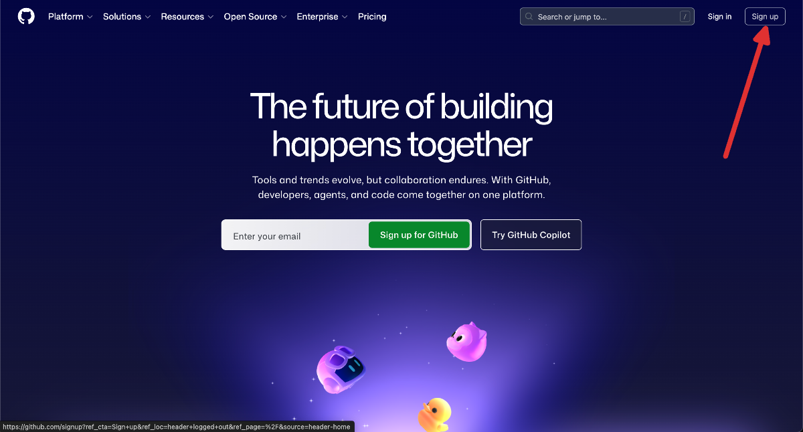
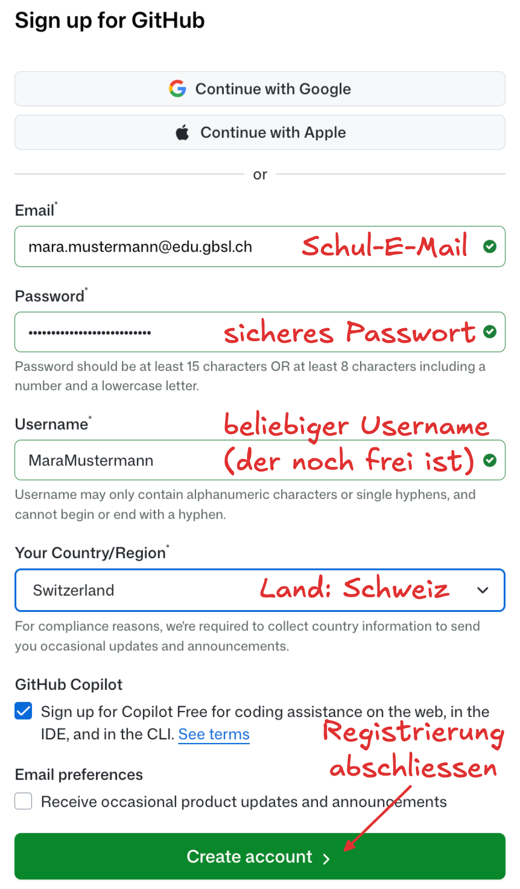

import Steps from '@tdev-components/Steps'

# Kickoff EF Informatik
Herzlich willkommen beim EF Informatik! Es freut uns, Sie zum Kickoff-Event begrüssen zu dürfen.

:::aufgabe[VSCode installieren]
<TaskState id="de4d589c-6734-438f-b4bc-c83510ee4a73" />
Installieren Sie die Programmierumgebung _Visual Studio Code_ (kurz: _VSCode_) auf Ihrem Computer. Folgen Sie dazu dieser [Anleitung](./Anleitungen/VSCode/01-Setup/index.mdx).

Kehren Sie danach auf die aktuelle Seite zurück und markieren Sie diese Aufgabe als erledigt.
:::

:::aufgabe[Python installieren]
<TaskState id="6f339f34-5ab2-4c39-8c39-8b5da8bf8b3f" />
Installieren Sie die Python-Umgebung auf Ihrem Computer. Folgen Sie dazu dieser [Anleitung](./Anleitungen/Python/index.mdx).

Kehren Sie danach auf die aktuelle Seite zurück und markieren Sie diese Aufgabe als erledigt.
:::

:::aufgabe[GitHub Account erstellen]
<TaskState id="08b272ef-2b73-437e-ad08-e469e7c9eb47" />

<Steps>
  1. Öffnen Sie die Webseite [https://github.com/](https://github.com/) und klicken Sie auf __Sign up__.
     
  2. Füllen Sie das Registrierungsformular aus. Verwenden Sie dabei Ihre **Schul-E-Mail-Adresse**, wählen Sie das **korrekte Land** aus, und notieren Sie sich den **Username** und das **Passwort**. Der **Username** ist frei wählbar. Sie benötigen ihn im nächsten Schritt gleich wieder.
     
  3. Geben Sie hier Ihren **GitHub Username** ein, den Sie im vorherigen Schritt gewählt haben. Achten Sie darauf, dass nach der Eingabe im Textfeld rechts kurz ein blaues Speichersymbol (Diskette mit Gutzeichen) erscheint, damit Ihre Eingabe auch sicher gespeichert wurde.
     <Answer type="string" label="GitHub Username" placeholder="Ihr GitHub Username" inputWidth="20em" id="1c13f9e2-8f34-42df-b362-b3c59d2cb05e" />
  4. Markieren Sie die Aufgabe als erledigt.
</Steps>
:::

::::aufgabe[WSL2 einrichten]
<TaskState id="7c7d99a8-65b2-489a-9aee-48733d70a7ab" />
:::warning[Nur für Windows-Benutzer:innen]
Die Einrichtung von WSL2 ist nur für Windows-Benutzer:innen relevant. Wenn Sie macOS verwenden, können Sie diese Aufgabe direkt als erledigt markieren.
:::

Jedes Betriebssystem (Windows, macOS, Linux) hat seine eigenen Besonderheiten. Für die Softwareentwicklung ist es oft praktisch, ein sogenanntes **Unix-ähnliches Betriebssystem** zu verwenden: Dazu zählen macOS und Linux. Windows ist kein Unix-ähnliches Betriebssystem, weshalb wir auf Windows-Rechnern eine sogenannte **Linux-Umgebung** einrichten müssen. Diese Linux-Umgebung wird über die Software **WSL2** bereitgestellt.

Installieren Sie das **Windows Subsystem for Linux 2 (WSL2)** auf Ihrem Computer. Folgen Sie dazu dieser [Anleitung](./Anleitungen/WSL2/index.mdx) und bearbeiten Sie die dortige Aufgabe.

Kehren Sie danach auf die aktuelle Seite zurück und markieren Sie diese Aufgabe als erledigt.
::::

:::aufgabe[VSCode kennenlernen]
<TaskState id="a23c2a15-2458-41de-93ab-30628cb2d2ce" />
Lesen Sie sich den Artikel [VSCode kennenlernen](./Anleitungen/VSCode/02-Introduction/index.mdx) durch. Dort werden Ihnen die wichtigsten Funktionen von VSCode erklärt.

**Optional** können Sie das dort beschriebene Demo-Projekt auch gleich selbst mit aufsetzen und ausprobieren und die dortigen Aufgaben erledigen.

Kehren Sie danach auf die aktuelle Seite zurück und markieren Sie diese Aufgabe als erledigt.
:::

:::aufgabe[Programmier-Repe]
<TaskState id="b1dec231-feab-4988-b515-c053a6b8c6c6" />
Um nach den Ferien optimal auf den vertiefenden Programmierunterricht vorbereitet zu sein, beginnen Sie bereits heute mit den ersten [Programmier-Repetitionsübungen](../Programmieren/Repetition). Wir empfehlen, diese Übungen über die Sommerferien nach Bedarf weiter zu bearbeiten.
:::